Once again, feel free to skip ⏭️ to any chapters or versions that interest you 😊.

## Table of Content 📖
Chapter 1: Collecting raw data 
- 1.1: [Web Scraping](#11-web-scraping) 
- 1.2: [Automating Web Scraping with GCloud](#12-automating-web-scraping-with-gcloud) 
- 1.3: [Creating a Dockerized Container](#13-creating-a-dockerized-container) 
- 1.4: [Setting up GCloud Bucket and Scheduler](#14-setting-up-gcloud-bucket-and-scheduler)


Chapter 2: Object Detection
- 2.1: [OpenCV and YOLOv4](#21-opencv-and-yolov4)
- 2.2: [Annotating with CVAT](#22-annotating-with-cvat)
- 2.3: [YOLOv8 and pain](#23-yolov8-and-pain)

Chapter 3: Processing and Visualizing Data
- 3.1: [Data Preprocessing](#31-data-preprocessing)
- 3.2: [Exploratory Data Analysis (EDA)](#32-exploratory-data-analysis-eda)

Chapter 4: Machine Learning
- 4.1: [One-hot encoding, sin-cos encoding, and Linear Regression model](#41-one-hot-encoding-sin-cos-encoding-and-linear-regression-model)
- 4.2: [Random Forest (+ Decision Tree) Regression](#42-random-forest-and-decision-tree-regression-regression)
- 4.3: [Feature Engineering (in progress, tbc!)](#43-feature-engineering-in-progress-tbc) (delete when done)
- 4.4: [Model Tuning (tbc)](#44-model-tuning-tbc) (delete when done)

Chapter 5: Deploying Code to Website
- 5.1: [Backend with GCloud and Flask](#tbc) (delete when done)
- 5.2: [Dockerfile??](#)


[Conclusion](#conclusion)


## 📚 Documentation


## Chapter 1 - Collecting raw data


### 1.1: Web Scraping


Time to collect the most important ingredient in any data analysis or machine learning project: **Data**. Firstly, I import all the necessary libraries to use Selenium to scrape live data from a website:

>We need the **datetime** class, as it helps us to organize the data neatly by date and time. It also allows us to manage the date and time values which can be used during machine learning and graphing in Chapter 3 and 4.
```
from datetime import datetime
```
>We need the **Requests** library for interacting with websites and scraping them too.
```
import requests
```
>**Webdriver** works together with chromedriver.exe to create a 'robot' Google Chrome window, which you saw for a split second in the GIF above (Fig smth).
```
from selenium import webdriver
```
**Service** provides the path to the local chromedriver.exe file to Selenium
```
from selenium.webdriver.chrome.service import Service
```
**By** helps me to find the object I want to scrape by letting me key in attributes of the object so that Selenium knows what object i want to scrape.
```
from selenium.webdriver.common.by import By
```
**Options** allows us to modify the web scraping process. For example, we can run chrome in 'headless mode' by doing this `chrome_options.add_argument("--headless")`.

This allows us to carry out the web scraping task but without the chrome window popping up like you saw in the earlier GIF.
```
from selenium.webdriver.chrome.options import Options
```
- Now moving on to the actual code, starting with the function `getjpg(url)`, where the 'url' inside the brackets is the only argument of the function and is where we will pass the LTA website's url.

    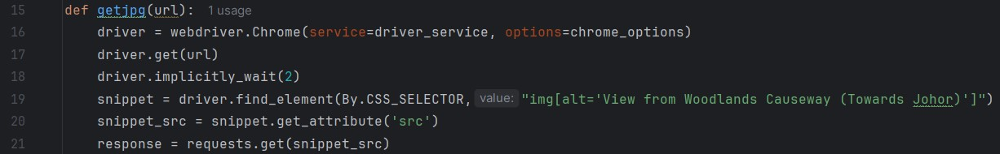

    Fig 1.1: Web scraping portion of `getjpg` function

    Let's go through each line of code one by one:

    For Line 16, we are launching the Chrome window with our custom chrome options. Line 17 then gives the url for the Chrome window to go to, followed by Line 18 which waits 2 seconds for all html elements to load.

    Line 19 gets the snapshot element from the website using the attribute 'alt' which is unique to the snapshot object. Then in Line 20 we get the actual image url through the 'src' attribute, as you can see in Fig 1.2 below.

    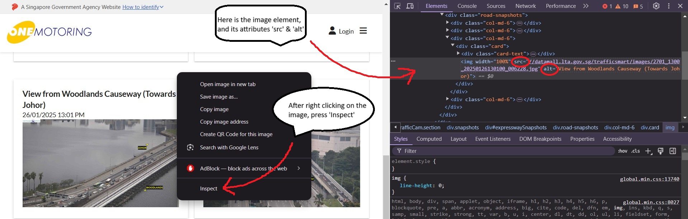

    Fig 1.2: Attributes and tags of snapshot element can be seen by right clicking and pressing 'Inspect'/ 


    Line 21 captures the actual image and downloads it into the current directory, the project's repository folder.

- The second part of the function focuses on the format of the image file name after downloading it, as that will be important in the later chapters for organizing and visualising of data.

    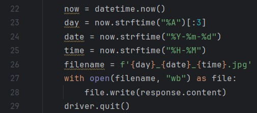

    Fig 1.3: Constructing image file name

    Line 22 gets the day, date and time at the moment the code is run, all in a single datetime object. Lines 23, 24 and 25 split the datetime up into its day, date and time components after it is converted to a string using strftime.

    Line 26 forms the filename by using an f-string to structure the day, date, time and jpeg file extension into a neat filename. Line 27 and 28 adds the file to my laptop, and Line 29 ends the Chrome window session.


The result is what you see in Figure V, I also wrote a print() statement which displays the name of the file saved, as you can see at the bottom of the screen where my mouse is circling. This is just to confirm the naming format is correct.

The 'yay' is a another print statement i put at the end of the web scraping `getjpeg` function so I know that the code ran smoothly. 

These print statements may not look important now, but in the next subchapter where I move this code to Google Cloud Run Functions, there will be many hiccups and errors. 

I need to know at which point did the code stop working, so its important to set up logging statements here and there, which allows us to pinpoint where the code stopped based on which statements are output.

I know this is in the overview above already, but I like GIFs so ill put it down here again👍.

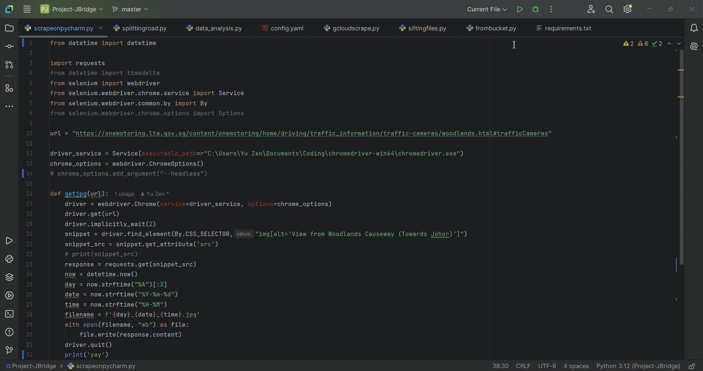

The web scraping script works and all, but I want to be able to automate it and not have to open my laptop every hour to run the code. In the next subchapter, I prepare my code to run in a dockerized container from Google Cloud.

### 1.2: Automating Web Scraping with GCloud

---

After trying out various cloud services like PythonAnywhere and Amazon Web Services (AWS), I eventually settled on Google Cloud

One reason is because PythonAnywhere could not run Selenium chromedriver (which I only found out after paying for it 🥲). Plus I already had a Google account with billing set up prior to this project 💸, but not for Amazon. Also I don't like Jeff Bezos, but thats a story for another day.

Anyway, let's adapt this code to Google Cloud Run Functions. Google Cloud is Linux-based, so we will have to change the way the chromedriver is installed and run 🔧.

The adapted code is in [gcloudscrape.py](python_scripts/gcloudscrape.py). Very similar, but with more imported libraries and functions. Let's start with the new libraries.

```
from google.cloud import storage 
```
This library is for storing the image files to Google Storage Bucket 🪣
```
from io import StringIO
```
StringIO allows for reading of file data from a Storage Bucket without needing to download it, which requires additional code and runs the risk of having duplicate files in the Bucket afterwards 📂. 

```
import chromedriver_binary
```
As dockerized containers are Linux-based, the process of running a Chrome window using chromedriver here requires directing the chromedriver path to the directory using this method instead.

Moving on to the code:

- For the function `adddatetime(bucketname, data)`, its primary use was to write down the date and time for every web scrape session into a csv file for tracking purposes 📝. But ever since I managed to code the datetime info into the filenames, the function is not of much use anymore.

    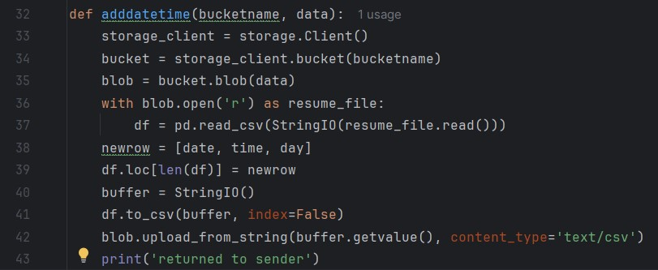

    Fig 1.4: `adddatetime()` function 

- The meat of the script is actually the function `scrapeaddpic()`, which not only scrapes the LTA website for the images like in Chapter 1.1, but also saves the images to the Google Storage Bucket. 

    I also added code to scrape the part of the crossing before the Singapore Woodlands Customs, as you can see in Line 53.

    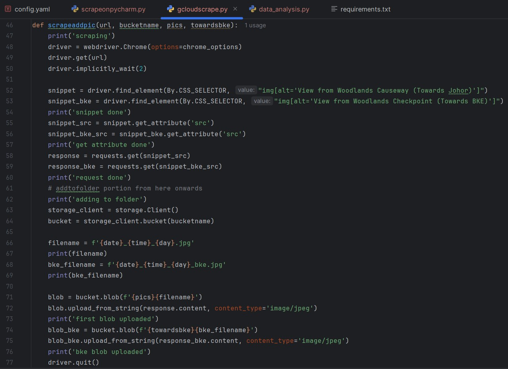

    Fig 1.5: `scrapeaddpic()` function, such an eyesore...

    You can also see I've sprinkled some print statements here and there ✨ (Lines 47, 54, 57, 60, 62, 73, & 76). 
    
    I can look back at the logs after running the code and see which statements were printed and which were not, allowing me to pinpoint where the code went wrong 🎯.

    To not bore ourselves with the nitty gritty, let's skip the parts already covered in Chapter 1.1 and go through this quickly 🧐:

    Lines 61-64 obtain the Bucket which we will be storing our image files in 🪣, and Lines 71 to 76 write the files to the bucket as 'blobs', which is Google Cloud's way of handling data for standardization purposes.

That's the main python script for Google Cloud, but theres more to automating code than just the code itself. Next we will be creating the GCloud dockerized container for the code to run in 📦.

> If you have any questions just telegram me, my @ is linked at the top. Like fr i need someone to discuss my projects with 🗿.

### 1.3: Creating a Dockerized Container

---

As the web scraping code will be running from the cloud without a platform like VS Code or PyCharm to execute it, we need to create whats called a "container" for the code instead with our very own [Dockerfile](GCloud/Dockerfile).

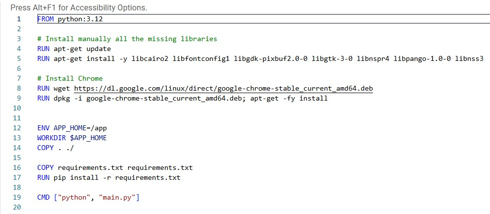

Fig 1.6: Dockerfile code screenshot from Cloud Run Functions

Line 8 gets the latest version of Google Chrome and Line 9 installs it 📥. Line 4 ensures that all the packages installed is the most updated version there is 🔄, while Line 5 installs all the packages are needed for chrome to run in the docker environment, but not part of google chrome and so are not installed by the code in Line 9.

Take note that due to Line 4, the container's google chrome version will always stay updated, but the chromedriver version won't. Be sure to monitor the logs of the GCloud function 👀 and update the chromedriver binary version in requirements.txt when necessary.

Lines 12 and 13 moves our python file 🚚➡️ into the /app directory in the container 📦, and makes sure that subsequent commands like COPY in Line 14 and RUN in Line 17 will execute relative to /app. 

Line 14 copies all files that are created in the Run Function, but for some reason it was not working, so i ran the command again in Line 16 for requirements.txt. Then I installed the requirements into the container in Line 17. Finally, Line 19 runs main.py ▶️, our web scraping python file.

**Quick Reflection:** The code itself is really little, but don't let that fool you. This was the hardest part of the project 💪, and it really killed me because I had never used Google Cloud to run code or used Linux before, let alone know what a dockerized container was 📦. 

I had to borrow many 'Google Cloud for beginners' books 📖 and watch numerous tutorials 👨‍💻💢, just to get the knowledge i needed to make this little shi-

It was pretty discouraging, because the more I learnt, the more I realised how much *I didn't know*. Furthermore, some of the books and tutorials were outdated and did not work like it was supposed to, which I only realized after spending weeks trying to learn it 😩. That's probably my bad though I should have picked the more recent ones from the start.

But after 2 arduous weeks, I finally managed to get a container, with chrome and chromedriver properly installed, up and running without any problems. That was a good day, felt super accomplished.

### 1.4: Setting up GCloud Bucket and Scheduler

---

First I created the bucket 🪣 in GCloud storage called 'frickubucket' (don't ask me about the name I made it at 2am on a Sunday morning 😵‍💫), then added 2 folders 📁. One for pictures of the crossover before Singapore Woodlands Checkpoint called towardsbkesnapshot/, and the other for pictures of the crossover after the SG checkpoint and leading up to the JB customs. This folder was simply called snapshots/.

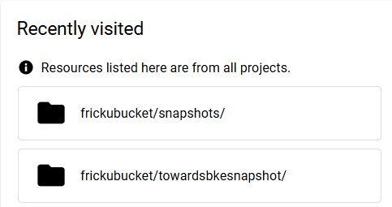

Fig 1.7: Bucket and folders in GCloud storage

Below are all the pictures that have accumulated in snapshots/ since I started the cloud scheduler in November 2024 📸.

As you can see all the filenames are formatted nicely as date_time_day.

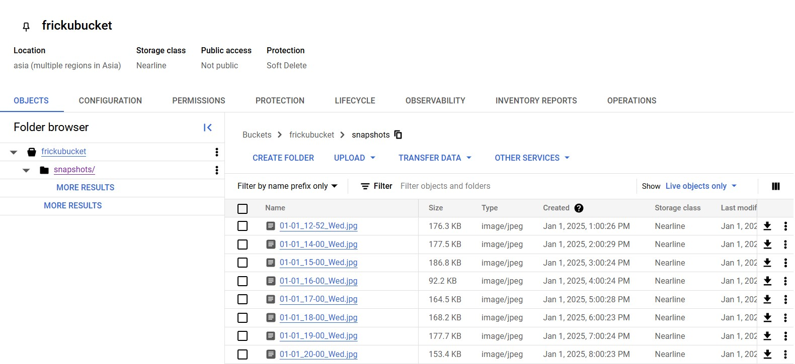

Fig 1.8: jpeg files inside the snapshot/ folder

Of course, all the work prior would be useless if not for the GCloud Scheduler job running everything periodically 🔁. Here is it's configuration:

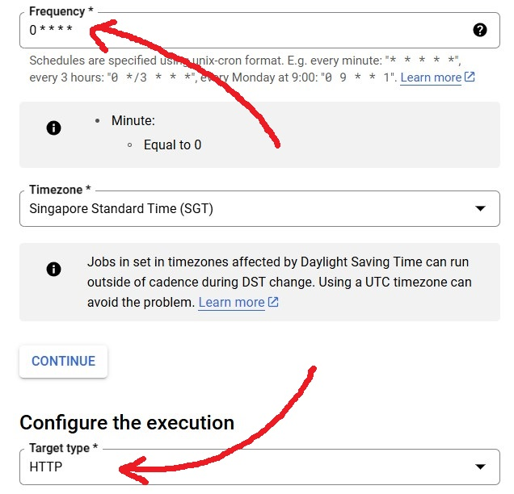

Fig 1.9: Scheduler job's configuration

At the bottom, you can see the execution target type is set to `HTTP`. This is to tell the job that our code is a webscraping code that targets `HTTP`/`HTTPS` websites 🌐 (all standard Google website links start with either one or the other).

At the top, you can see the job frequency, which controls the dates and times at which your code runs.

Scraping the LTA website at a high frequency 📶 (eg: every 2, 5 or 10 minutes) may help pinpoint times of congestion more accurately, but it will also:

 1) take up more space in the Bucket folder, and 
 2) mean that the code has to run more often in a short span of time. 

These make the process more computationally expensive and would lead to additional costs for me 💸😭. However, having too much time between web scrapes makes it hard to capture congestion trends.

Finally I settled on what I think is a balanced time interval of 1 hour between scrapes, thats why the timestamps of the images in Fig 1.7 are all an hour from each other.

This translates to a frequency configuration of `0 * * * *`, which is quite confusing if you are not familiar with the time-field formatting which GCloud Scheduler uses (like me at the start of this project).

Here is a snippet from Google's Cloud scheduler guide 📝 to help you.

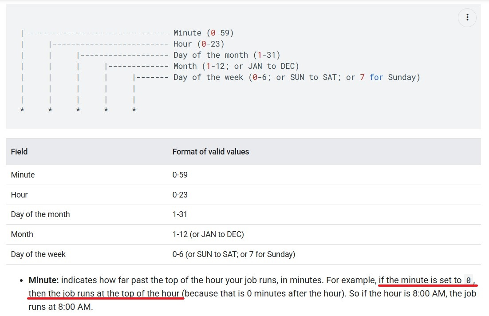

Fig 1.10: Cloud Scheduler time-field formatting information

In order to collect the data from the bucket, you need a python script and link your google credentials to said script. You can find mine [here LINKKKKKKKKKKKKKK](), the filename is frombucket.py. You won't find my credentials though cuz that stuff is private, if you want you can get your own under your gmail account its free.

That wraps up Chapter 1, let's move on to object detection in Chapter 2.


## Chapter 2 - Object Detection
### 2.1: OpenCV and YOLOv4

I found OpenCV and YOLO from a nice chap who goes by the name of [Pysource](https://www.youtube.com/@pysource-com) on YouTube, it was from his videos that I got introduced to computer vision and its many uses. 

In this particular [video](https://www.youtube.com/watch?v=O3b8lVF93jU&t=46s&ab_channel=Pysource), he shares the weights of a yoloV4 object detection model that was already pre-trained 🏋️‍♀️ on tens of thousands of cars, which saves us the hassle of manually drawing the car objects' bounding boxes ✍️ and feeding the training images to the model. 

The object detection model consists of 2 files. One is [vehicle_detector.py](python_scripts/vehicle_detector.py), which defines the object classes and retrieves the pre-trained weights ⚖️ using OpenCV.

The other is [yoloimage.py](python_scripts/yoloimage.py), where you define the image you want to carry out object detection on and feed it to the model. The results are quite accurate, as you can see in the figure below 🎯.


Fig 2.1: Pysource's YOLOv4 model performance (a screenshot from his video)

However, the difference in resolution between pictures taken from afar by LTA traffic cameras (installed more than 2 decades ago) and modern webcams much closer to the highway 🛣️ (like in Fig 2.1) is large 👀. Below is a picture of the causeway after annotations by the pre-trained YOLOv4 model.

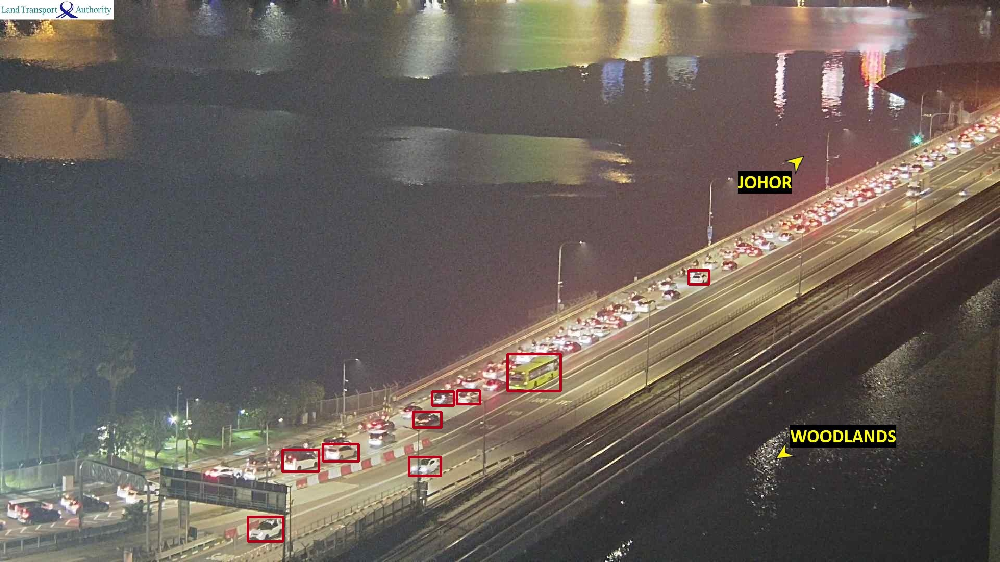

Fig 2.2: Pre-trained YOLOv4 model's annotations on a picture of the causeway

While some vehicles were detected 🔍, the majority of the cars were not. It also detected a bus which is not our intention.

This model may work if the camera pictures were of higher quality, but the data quality cannot be changed. Instead, we have no choice but to improve the model. Easier said than done though🥴...

### 2.2: Annotating with CVAT

---

#### How object detection works
To train an object detection model, you need to tell it what kind of object you want it to detect 🔍. This means force-feeding it pictures of said object highlighted in a bounding box, until it learns what the object 'looks like' 🚗. 

A bounding box is the box that surrounds the object in the image, you can see a couple in [Figure IV](progress_pics/Fig-IV-yolo_beachscreenshot.jpg) above in the Overview🔎. 

Each bounding box has a centre coordinate value, a width and length value, and a class value, which tells the YOLO model what object class it is (ill explain more on classes later). The centre coordinate value will come in handy later on in [Chapter 3.1](#31-data-preprocessing).

Of course, the number of pictures you need to sufficiently train a model depends on:

1) the quality and resolution of your picture 🖼️. a model can pick up patterns in the image pixels better if there are more pixels.

2) how complex your object looks. Learning the characteristics of something simple, like for eg: a sunflower 🌻, which do not vary in shape or design, is relatively simple. 

Cars on the other hand are more difficult, with varying numbers of doors, colours, designs, etc 🚗 🚙 🚕 🚓.

The model needs to generalise its object detection pattern and not overfit on irrelevant attributes unique only to certain cars.
    
This means learning general characteristics of cars, such as '4 wheels', and not fixating on things like '2 doors' or 'spherical headlights', as not all cars have those features.

Unfortunately, our data ticks neither box. The image quality isn't the worst, but having the cars so far away means that the image pixels making up the cars are fewer. It also does not help that the image quality becomes even grainier on rainy days 🌧️.

[insert rainy day pic here LINKKKKKKKKKK](GCloud\snaps_3\11-17_13-00_Sun.jpg)

Fig 2.3: Picture of the bridge on a rainy day, looks like it was taken in 12 b.c

Furthermore, the headlights of cars at night make it difficult to see the outline of the car bodies (Fig 2.4)

[insert nightime pic here OIIIIIIIIIIIII](GCloud\snaps_2\11-29_07-00_Fri.jpg)

Fig 2.4: Picture of the bridge at night, the headlights are very glaring.

With all these problems, its a 50/50 whether or not the YOLO model will ever be able to detect the cars if I annotate enough training images. However, YOLO has been able to detect objects of only about 16x16 pixels in an image. Also, to detect such small and grainy objects like in our case, we probably need around one to two thousand training images minimum.

Right now the success of the YOLO model is still uncertain 🤔, but I won't quit until I at least hit 2000 manually annotated training images. If the performance still does not improve at a satisfactory rate, then I may have to admit defeat. 

However, at that point we would have a large enough training dataset of 2000 hours of data for decent data analysis with Tensorflow or SKlearn machine learning, enough for the insights gathered to be more reliable and accurate👌.

#### CVAT

CVAT is a website that allows you to manually draw bounding boxes ☐ around objects of interest 🚘 in your training images. If you have an object that is unique or niche that nobody else has trained an object detection model for, this website can help you. 

However, if the object you are trying to detect is quite well known (eg: dogs, people, etc), you are better off looking for a pre-trained model that already had someone else do the dirty work, rather than spending time drawing bounding boxes yourself 🐶.

I annotated about 14 images worth of cars to start ✏️ and trained my first ever YOLO model with them. I set the number of epochs to 40, which is the number of times the object detection model goes over the training data, kind of like how you revise your textbooks repeatedly to better solidify the knowledge into your brain 🔄. 

However, unlike us humans, going over the training data too many times 🌀 can result in the model learning unnecessary details and characteristics, causing it to overfit to the training data, hence I set the epoch number at low 40 to test the waters.

At this time, I had just started my object detection journey after seeing people train successful models with just 50 to 100 high resolution training images, so poor me had no idea that low resolution images meant I had to annotate **a lot** more ✏️

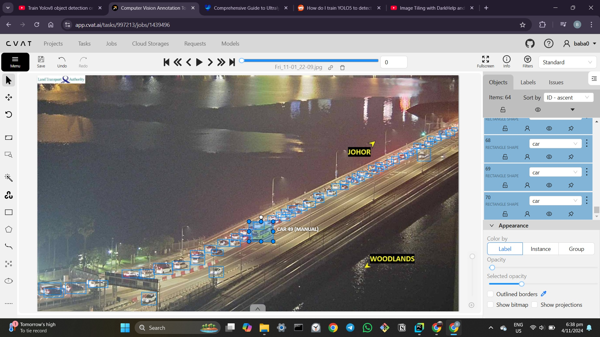

Fig 2.5: First time using CVAT

Obviously, the model did not do well, detecting no cars whatsoever. I also received some metrics of the object detection process.

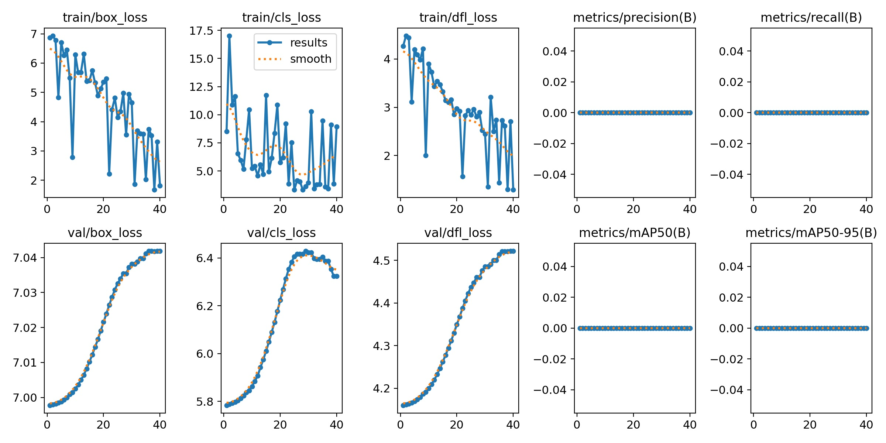

Fig 2.6: Metrics of object detection model's first training attempt

I'm not super knowledgable on the math and nitty gritty of object detection ML/DL, but I do know that loss = errors = 👎. And as you can see at the bottom left, the validation loss is actually **increasing** as the number of epochs increases. 

By right, the more times a machine learning model goes over the training data, the more it should be refining its weights and improving its performance 🔧. So obviously, this training session was a failure.

I tried to find loopholes around the picture quality to train the YOLO model, such as detecting traffic congestion areas as a whole:

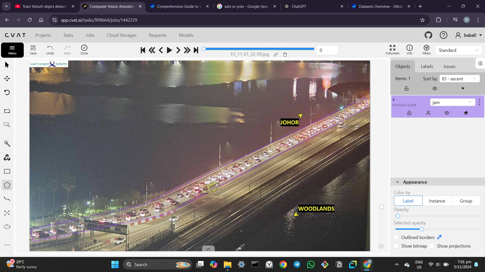

Fig 2.7: Hexagon bounding box

However, this did not work. This is because they need the centre of the box to be clearly defined to accurately identify the centre of mass of the object and generalise characteristics, and YOLO is not able to do so for odd shapes 🛑.

YOLO breaks up the box into a grid of pixels to detect patterns and calculate loss. This process is programmed in a way that it only supports 4-sided, axis-aligned 📐 bounding boxes. I'm not educated enough on the subject to know the exact details behind the way the YOLO model is set up 📚, so I cannot explain specifics. For that I apologise.

In the end, I settled for identifying **areas** of congestion on the causeway 🛣️. It somewhat solved the low-pixel problem by making the bounding box area bigger, while at the same time still keeping the majority of the bounding box around an area of cars. It was also feasible with 4-sided-boxes aligned to the axes.

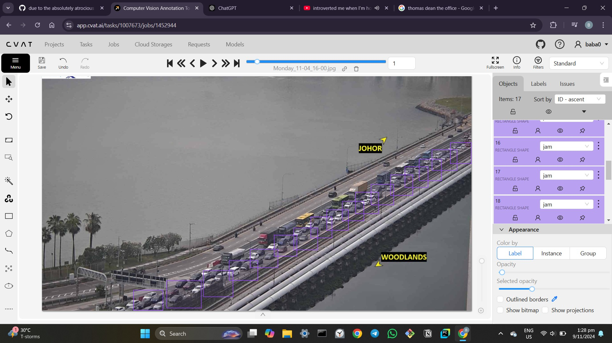

Fig 2.8: Bounding boxes now surround areas of congestion rather than individual cars

### 2.3: YOLOv8 and pain

---

After a few weeks of monotonous manual annotating, I managed to get 184 training images. I trained the model again and kept the epoch parameter the same as before.

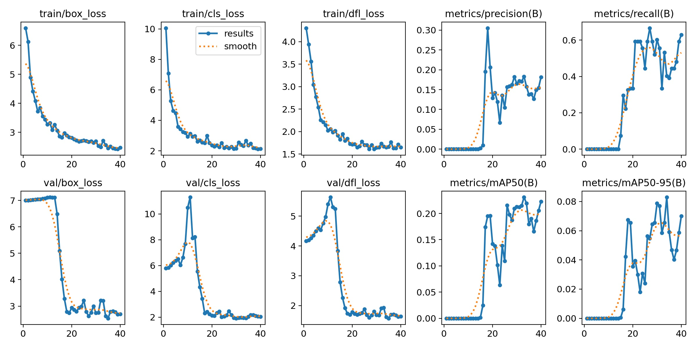

Fig 2.9: metrics from training with 184 training images

The numbers are still far from ideal, but at least the loss is decreasing now 📉 instead of increasing with epoch number.

Afterwards, there was just a bunch more annotation ✏️. I split the total images I had at the time (about 1000) into 7 batches in the GCloud folder 📦. I hit 334 training images after annotating the 2nd batch and trained the model again:

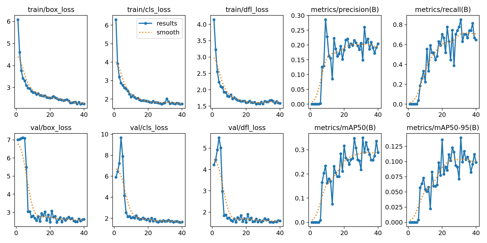

Fig 2.10: metrics from training with 334 training images

The results did show improvement 📈 in model performance, but not much. The training loss and validation loss only improved very slightly from when i trained the model with 184 images, almost half the number of images. Same for the recall and precision, only marginally better, and they were not smooth curves meaning the model is not performing very consistently. Not good news.

A few late nights later, I hit 514 images after completing the 3rd batch 📦 of image annotations:

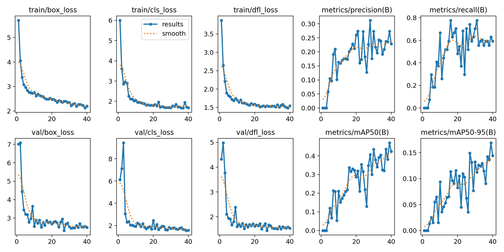

Fig 2.11: metrics from training with 514 images

Slight improvement, the metrics mAP50 and 50-95 which, to my limited understanding, basically sees if there is a certain amount of overlap between the actual bounding box and that placed by the model, have increased from when the model was trained with 334 images, from around 0.3 to 0.4. 

The mAP50-95 (basically the same thing except the amount of overlap varies) also increased ⬆️ from around 0.100 to slighly below 0.15. It also looks like validation dfl loss decreased slightly ⬇️ (rough explanation: measures loss for the corners of the bounding box placed by the model). However, it looks like the box loss gradient may be stagnating 〰️ which does not look good.

Here are the metrics of the 2 model metrics side by side so its easier to compare:

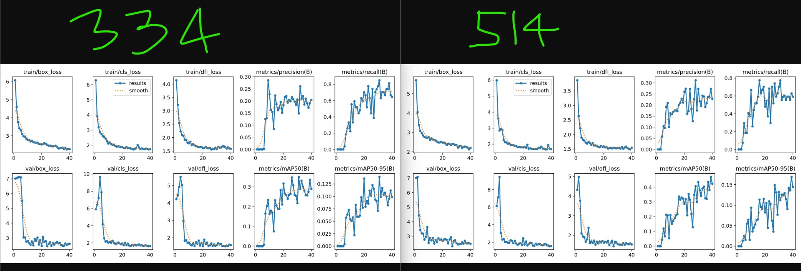

Fig 2.12: Fig 2.11 on the right, Fig 2.10 on the left

On a brighter note, when I used the weights of the model after this training session ⚖️ on a random image of the bridge taken at night 🌙, it managed to detect a small fraction of the congestion in the picture. 

Granted, it doesn't look very impressive, but it was my first visible progress after a long period of work and no results, so I was quite thrilled.

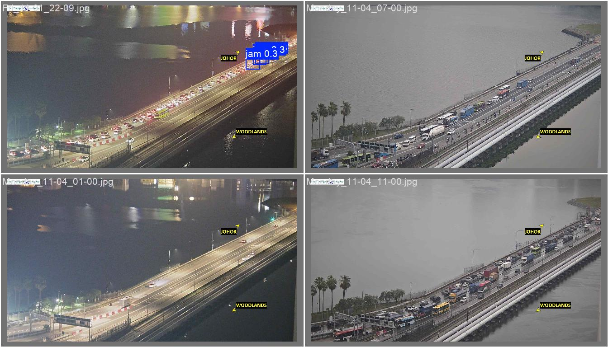

Fig 2.13: First annotation by model

As I annotate more images, I will continue to update you guys on the results for future models. We have about 1300 currently, and so far only about 500 have been annotated (batch 3 out of 7 📦), so I feel there is still potential for the YOLO model. Or maybe im just being delusional. Either way, I'm not stopping until I reach 2000.

Now that we have a decent amount of raw data on the causeway congestion, we can preprocess the data and use tables/graphs 📊 to contextualize it for better readability and understanding.

## Chapter 3 - Processing and Visualizing Data
### 3.1: Data Preprocessing

The source code for this subchapter can be found in [splittingroad_&_preprocessing.py](python_scripts/splittingroad_&_preprocessing.py)

#### Differentiating the roads

Its all well and good if we can identify areas of congestion on the causeway, but the causeway goes both ways 🛣️. While theres a jam on the road towards Woodlands, the road to Johor could be empty.

Us humans can tell which road goes to which country 🇸🇬/🇲🇾, but the object detection model only cares about detecting areas of congestion on both roads, not which road is congested. We need a way to tell our code which road is congested to conduct any meaningful data analysis 📊.

This problem puzzled me for quite a while and I researched some possible ways to get around this, such as incorporating image cropping into the code such that it separated the 2 lanes ✂️ into separate pictures, or using shapes to define the regions of the road. None of those really appealed to me though, and eventually I settled on using the centre coordinates 📍 of the bounding boxes to determine which lane the congestion belonged to.

First, I gathered the centre coordinates of all bounding boxes in every single image of the causeway I annotated, then I plotted them all into a graph using Matplotlib.

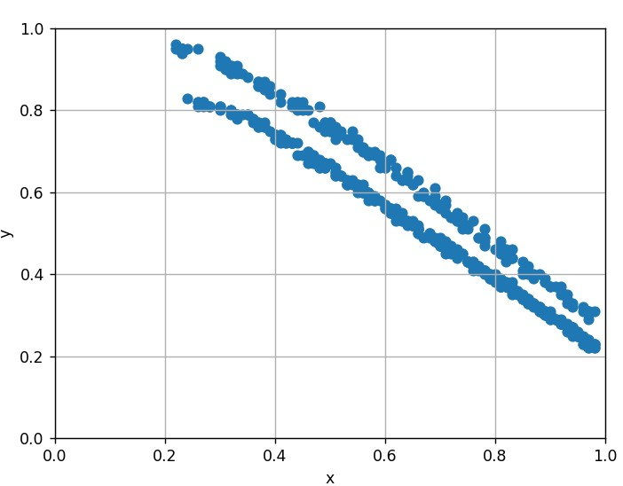

Fig 3.1: Plotted coordinates of all bounding box centres

Notice something? There is a clear separation ✂️ between what appears to be 2 groups of coordinates, obviously the 2 groups are the lanes of the coordinates.

The plan now is to plot a line that perfectly separated the 2 groups, so that in the future, the code knows how to differentiate coordinates and their lanes by simply looking at which side of the separating line they lie on.

At first, I tried to separate them with a normal straight line. I did some trial and error and came up with was a formula of: y = -0.94x + 1.18

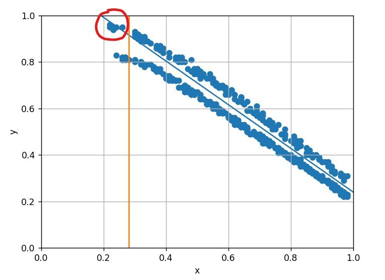

Fig 3.2: Straight line graph plotted together with bounding box coordinates

Its not bad, but you look carefully at the top left of the graph, there's a tiny problem. Some coordinates belonging to the top group managed to sneak below the line. Incorrect data leads to incorrect predictions and flawed data analysis, which is unacceptable.

After tinkering with Matplotlib and Desmos, the online math graphing app, for a bit, I managed to get a curve that perfectly separated the coordinates.

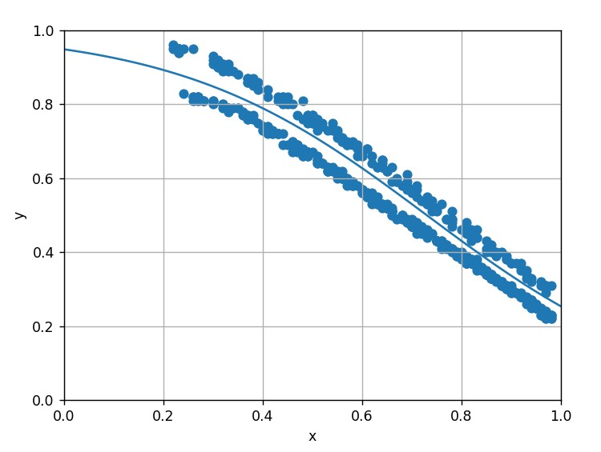

Fig 3.3: Curved line separates all the coordinates, including the ones at the top left which the straight line could not

This curve actually originated from a sigmoid. I was looking at different types of curve lines and their formulas, and the sigmoid caught my eye. Thanks to Graphs and Transformations from JC maths, I managed to invert the sigmoid about the y-axis and adjust its y-intercept, as well as its gradient (x coefficient), finally getting the formula of the perfect line: y = 1/1+e^^4(x-0.73)

Using this formula, I coded splittingroad.py, which goes through every single bounding box's centre coordinate 📍 and subs it's x-coordinate into the formula 🧪. If the y value from the formula > the actual y-coordinate, that means the coordinate is below the line and belongs to the lane below the curve. 

I separated the coordinates into 2 different lists, then coloured the coordinates differently in Matplotlib (Fig 3.5, which is further down below).

Thats the TLDR of the first part of code in splittingroad.py, now I will explain how the whole thing works in detail part by part 🔍

```
import os
import matplotlib.pyplot as plt
import numpy as np
```
First I imported the required packages: 
- **os** for extracting and working with local files 🗂️
- **matplotlib** to plot the coordinates in a graph 📊
- **numpy** for its math functions 🔢 which we use to plot our sigmoid curve

```
1   folder_path_template = r"C:\Users\Yu Zen\Documents\Coding\Project-JBridge\GCloud\coords_"

2   x_coords = []
3   y_coords = []
4   for i in range(1, 4):
5        folder_path = folder_path_template + str(i)
6        for file_name in os.listdir(folder_path):
7           file_path = os.path.join(folder_path, file_name)
```
Lets start simple with Lines 2 and 3. As you can probably tell from their names, they are just lists to store the x and y coordinate values of the bounding box centres. 

In Line 1, I define 'folder_path_template'. If you look carefully at my coord files 🗂️ (which contain the bounding box details and coordinates) in the [GCloud](GCloud) folder, you will see that they have names like 'coords_1', 'coords_2', etc. But the path ends in just 'coords_', hence its called a "template".

This leads us to lines 4 and 5. Line 4 iterates through the numbers 1 to 3, and Line 5 attaches the string number to the end of the template to form the actual 'folder path'🗂️. 

I went through the trouble of making a template so that in the future, when we have many 'coord' files, we don't have to keep adding file paths, we can just edit the latter number argument in range(). 

Was pretty chuffed with myself for coming up with this 😤

Lastly, Lines 6 and 7 attach the names of the actual files 🗂️ in the coord folder ➰ to the end of the 'folder path' to form the 'file path'. Here, I utilize the 'listdir' and 'path.join' capabilities of **os**.

Moving on with the rest of the 'for' loop:
```
8          with open(file_path, 'r') as file:
9              for line in file:
10                 numbers = line.split()
11                 x_coords.append(float(numbers[1][:4]))
12                 y_coords.append(float(numbers[2][:4]))
```
After opening the file in read mode (Line 8), I iterate through each line in the file. For the next lines, its important to understand how the files' contents are formatted. 

Here is how the contents of a typical bounding box file looks like.

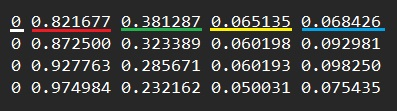

Fig 3.4: contents of one of the thousand bounding box files

This particular [file](GCloud/coords_2/11-15_13-00_Fri.txt) has 4 bounding boxes, hence there are 4 lines of data.

The first value is the object class, underlined in white ⚪. As we only have 1 object class 'traffic jam', hence they are all the same number '0'.

The second value is the x-coordinate of the bounding box centre, underlined in red 🔴. The third value underlined in green is the y-coordinate 🟢, and the value underlined in yellow is the width of the bounding box 🟡. The last value, the one underlined in blue, is the height of the bounding box 🔵. 

> This strict YOLO file formatting also shows how bounding boxes not aligned to the axes or of varying number of sides will not work 🚫, as stated in Chapter 2.2.

In Line 9, I go through the lines of data one by one. In each line of data, I split the 5 numbers (Line 10), then add the 2nd number (x-coord underlined in red🔴) and 3rd number (y-coord underlined in green🟢) to the x-coord and y-coord lists respectively in Lines 11 and 12.

I converted the string values to float (using float()) for math calculations later on, and also only added the numbers up to 2dp (using string slicing - [:4]) for simplicity.

Now that we have acquired all the coordinate values neatly into x and y lists, its time to classify them into their respective roads on the causeway 🛣️, which is what the code in the 2nd part of splittingroad_&_preprocessing.py is about.

#### Segmenting the centre coordinates

```
1   x_coords_johor = []
2   y_coords_johor = []
3   x_coords_wdlands = []
4   y_coords_wdlands = []
```
We will be splitting the x and y coordinate values further, then they will be appended to their respective lists depending on which side of the causeway they are on.

```
5   for i in range(len(x_coords)):
6      x = x_coords[i]
7      actual_y = y_coords[i]
8      y = 1 / (1 + np.exp(4 * (x - 0.73)))
9      if actual_y < y:
10         x_coords_johor.append(x)
11         y_coords_johor.append(actual_y)
12     else:
13         x_coords_wdlands.append(x)
14         y_coords_wdlands.append(actual_y)
```


In line 1, I iterate through 🔁 the indexes in the 'x-coords' list, since it has the same number of values in the list 'y-coords'. Then I get the pair of centre coordinates in Lines 2 and 3.

Line 4 defines the inverted sigmoid formula we came up with earlier. The **numpy** package comes in handy here to get Euler's number, '*e*'.

The x-coordinate value is subbed into the formula, and Line 5 checks if the actual y-coordinate value is greater or smaller than the y value from the formula.

If the actual centre coordinate lies below the curve ⬇️, that means it belongs to the road going to Johor, otherwise it belongs to the road headed to Woodlands. Lines 6 to 10 append the coordinates to the correct lists mentioned above in Lines 1 to 4.

To make sure all the points were classified properly, I made a simple coloured scatterplot using Matplotlib 🔴🔵📈

```
1   plt.xlim(0, 1)
2   plt.ylim(0, 1)
3   plt.grid()
4   x = np.linspace(0, 1, 100)
5   y = 1 / (1 + np.exp(4 * (x - 0.73)))
6   plt.plot(x, y)
```
Lines 1 and 2 set the limits of the axes so neither axis has a tick of value greater than 1.

Line 3 enables gridlines ⊞ on the plot, while Lines 4 and 5 create the coordinates of the sigmoid curve, which is then plotted by the code in Line 6. 

```
7   plt.scatter(x_coords_johor, y_coords_johor, c='blue')
8   plt.scatter(x_coords_wdlands, y_coords_wdlands, c='red')
9   plt.xlabel('x value')
10  plt.ylabel('y value')
11  plt.show()
```
Line 7 plots the box coordinates 📌 that lie on the road to Johor and colours them blue 🔵, while Line 8 does the same for the road to Woodlands, except the coordinates are coloured red instead 🔴. Lines 9 and 10 label the axes, and Line 11 showcases the graph 📈

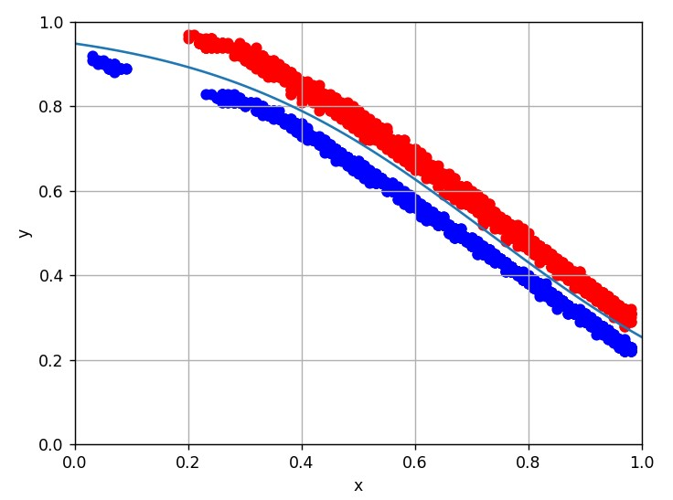

Fig 3.5: Plotted the sigmoid curve and coloured coordinates

If you are wondering why there seems to be even more points than in Fig VII, thats because I've annotated a few more batches since then, so theres more coordinates now.

With all the coordinates properly preprocessed and classified according to their road, we can now do some data analysis 📊

### 3.2: Exploratory Data Analysis (EDA)

The code in this chapter can all be found in [data_analysis.py](python_scripts/data_analysis.py)

First, I imported the packages I would need:

```
import os
import pandas as pd
import numpy as np
import matplotlib.pyplot as plt
```
The packages are the same as in chapter 3.1 except for pandas 🐼, as I will need the Dataframes𝄜that come with the pandas library to showcase the data in a neat table.

Then I defined a list of all the days in a week 🗓️, and a list of all the times of a day 🕒. This is needed for later when organising the congestion values in a pd dataframe according to day and time 🗃️

```
days = ['Mon', 'Tue', 'Wed', 'Thu', 'Fri', 'Sat', 'Sun']
times = ['00-00', '01-00', '02-00', '03-00', '04-00', '05-00', '06-00', '07-00', '08-00', '09-00', '10-00', '11-00', '12-00', '13-00', '14-00', '15-00', '16-00', '17-00', '18-00', '19-00', '20-00', '21-00', '22-00', '23-00']
```

Theres probably a more automated way around doing this, but its not worth the brain power compared to just listing them out like this compared to the file paths scenario.

```
1   area_dict = {}
2   for day in days:
3       area_dict[day] = {}
4       for time in times:
5           area_dict[day][time] = [0, 0]

6   table = pd.DataFrame(columns=days, index=times)
```
I then created a dictionary (day, Line 3) within another dictionary (area_dict, Line 1) to store 2 values (Line 5): 
1) the total area of bounding boxes for each day and time 📐
2) the number of instances of that particular day and time 🔢

This is so that I can calculate the average amount of congestion that occurs at that time and day by dividing total area (1st value) by total number of instances (2nd value).

In Line 6 I create a pd Dataframe defined as 'table' to store the average congestion area values at every time and day.

This next part of the code is quite complicated, so ill break it up into smaller chunks 😉

```
1   for num in range(1, 4):
2       path = coords_path_template + str(num)
3       for file_name in os.listdir(path):
4           parts = file_name.split('_')
5           date = parts[0]
6           time = parts[1]
7           day = parts[2][:3]
8           area_dict[day][time][1] += 1
9           file_path = os.path.join(path, file_name)
```
First I iterate over the numbers 1 to 3 🔄 (last number, 4, is not inclusive when using range()) to go over all coords folders 🗂️. I then extract each file from each folder (Line 3) and split their filenames into parts (Line 4-7).

This is the reason why I named the jpeg files like so in my GCloud web scraping code. Since the bounding box files returned by CVAT will also be of the same name as the jpeg files 📂, I could simply sort the files into dictionaries by using parts of the filename as dictionary keys 🔑(Line 8). I then construct the file path in Line 9.


```
1        with open(file_path, 'r') as file:
2            total_box_area = 0
3            for line in file:
4                numbers = line.split()
5                x = float(numbers[1])
6                actual_y = float(numbers[2])
7                y = 1 / (1 + np.exp(4 * (x - 0.73)))
8                if actual_y < y:
9                    box_area = float(numbers[3]) * float(numbers[4])
10                   total_box_area += box_area
```

I do the same thing as in Chapter 3.1, checking whether the centre coordinates lie below ⬇️ or above ⬆ the curve (Lines 1-7). However, unlike in [splittingroad_&_preprocessing.py](python_scripts/splittingroad_&_preprocessing.py), I don't classify the coordinates on the road to Woodlands. 

Thats because I'm only analysing data of congestion going into Johor as of now. So in this case, if the coordinate lies above the curve, I ignore it 🙈. You can see this in Line 8, where I only process the data if actual_y < y.

In Line 9, I calculate the area of the bounding box by multiplying the width ↔️ of the box(numbers[3]) by its height ↕️ (numbers[4]). Then I add the area to the total_box_area variable. This will represent how much congestion is present in that image. Greater area = Greater congestion.

```
11           area_dict[day][time][0] += total_box_area
12           total_area = area_dict[day][time][0]
13           instance_no = area_dict[day][time][1]
14           table.loc[time, day] = total_area/instance_no
```
With the file still open and in 'read' mode, I add the total_box_area to the 1st value of the list in the nested dictionary (Line 11). 

Then I define the sum of areas and sum of instances, before calculating the average congestion area and adding it to the table 📝(Line 14). Here is how the table looks.

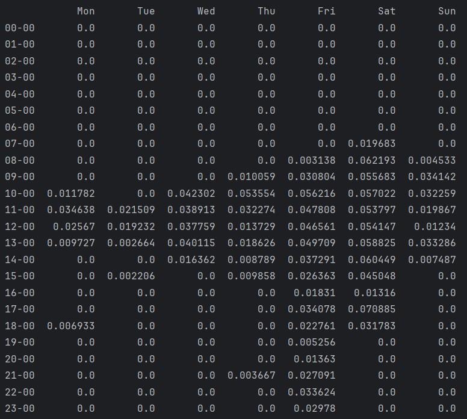

Fig 3.6: First look at table of congestion values

Not pretty. The values are oddly scaled, nobody would really understand what they mean, and they have more decimal places than I care to count 😵‍💫

Let's try to fix this, can't have my dataframe looking like ASCII art of a fish or something ( ◡̀_◡́)ᕤ

```
1   max_value = table.max().max()
2   table = table.astype(float)
3   table = table/max_value * 5
5   table = table.apply(lambda x: x.round(2))
6   print(table)
7   table.to_csv('sorted_data.csv', index=False)
```

My plan is to make the congestion area values scale from 1 to 5, with 1 being no/little congestion 😌, and 5 being very congested 😖. But before that I min-max scaled the values by getting the max value (Line 1) and multiplying all the values in the table by 5/max_value (Line 3). 

Line 2 is just to ensure all the values are floats so that we can round them off to 2dp (Line 5). Line 7 saves the table as a csv file, which you can see [here](python_scripts/sorted_data.csv), and Line 6 prints out the table.

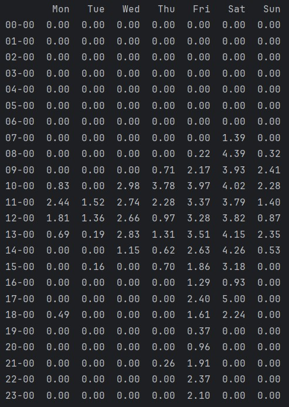

Fig 3.7: Same table, now scaled and rounded to 2dp

An improvement for sure, but still not much insight can be gained from a glance (👁ˋ _ ˊ 👁). Also its a bit too bland for my liking. But not to worry, we will be exploring other ways of data visualization in this chapter, starting off with a simple line graph 📈

```
1   d = 0
2   color = ['red', 'blue', 'green', 'yellow', 'black', 'purple', 'pink']
3   for col in table.columns:
4       y = list(table[col])
5       plt.plot(times, y, label=days[d], color=color[d])
6       d += 1
7   plt.legend()
8   plt.show()
```
First I created a list of 7 colors (Line 2), one for each day of the week 🗓️. The columns in the table are the days of the week, so I iterate over them using a 'for' loop 🔁 (Line 3).

Line 1 and 6 work together to select a different line colour for different days, with Line 6 increasing 'd' by 1 after every column value (day) is iterated over.

In Line 5, the average congestion area (y axis) is plotted against the 24 hour times of a day (x-axis). The label and line color is changed accordingly with days[d] and color[d] as 'd' increments. 

Finally, Line 7 adds a legend to tell the line graphs apart 📈📉 as you can see in the top right of the figure above, and Line 8 outputs the final product.

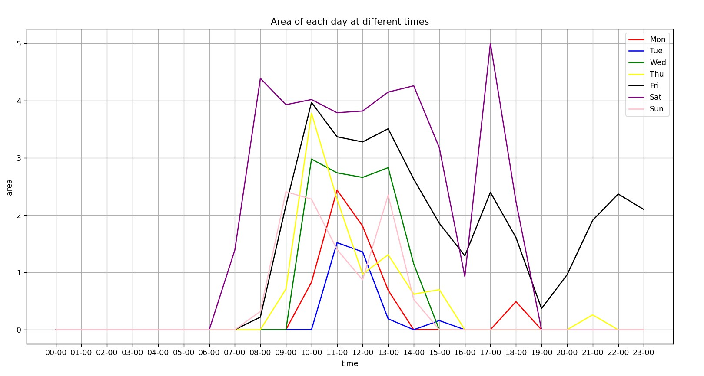

Fig 3.8: Coloured line graphs of congestion area against time of day

Pretty messy, but it gives a general idea of how congestion varies against time 🕒 for the different days.

The graph aligns with some common knowledge of the causeway, such as:

- presence of jam from 1900 to 2300 for only Fridays, as that is the period after work when people want to spend the weekend in Johor 🥳
- large spike in jam 📈 on Saturday mornings for people that are not willing to go to Johor immediately after work on Friday, but still want to spend some weekend time in Johor
  (Update: Afterwards, I found out that some muslims practice a Fri-Sat weekend instead of the traditional Sat-Sun, which could also explain the large influx of people going into Johor on Sat - probably Malaysian citizens who spent their weekend in SG returning home)

However, its interesting to note that there is not much jam on Sundays. My assumption was that both days of the week would have the roads to Johor jammed up, but I guess people aren't as willing to go to Johor on Sunday compared to Saturday. 

On the contrary, the road to Woodlands may be congested due to people coming back to SG after going to Johor on Saturday/Friday 🚗💨

Let's try bar graphs next. The plot containing line graphs for every day of the week is a little too cramped for my liking, so for the bar graphs I'll be plotting on separate axes.


```
1   fig, axes = plt.subplots(2, 4)
2   axesrows = [0, 0, 0, 0, 1, 1, 1]
3   axescols = [0, 1, 2, 3, 0, 1, 2]
4   for col in table.columns:
5       y = list(table[col])
6       axes[axesrows[d], axescols[d]].bar(range(24), y)
7       axes[axesrows[d], axescols[d]].set_xticks(range(24))
8       axes[axesrows[d], axescols[d]].set_xticklabels(times, rotation=66, fontsize=7)
9       axes[axesrows[d], axescols[d]].set_title(days[d])
10      axes[axesrows[d], axescols[d]].set_ylim(0, 5)
11      d += 1
12  axes[1, 3].axis('off')
13  plt.show()
```
Line 1 plots 8 subplots (2 rows by 4 columns), and Lines 2 and 3 represent the subplot coordinates. For example, [0, 1] is the 1st row 2nd col subplot, which represents Tuesday in Fig 3.10 below. 

Line 6 and 7 sets 24 bars 📊 across the x-axis in each subplot, with 'y' being the value for the bar height. Line 8 rotates the x-axis time labels 🔄 and sets the fontsize to a smaller 7 to prevent them from overlapping 🙂⃤

Line 9 sets the title according to days[d] which gives the correct day 📆 as 'd' increases (Line 11), and Line 10 sets the max bar height at 5 units. Line 12 removes the bottom right subplot, since theres space for 8 subplots but we only need 7, and finally Line 13 outputs all bar graphs.

> Or are they histograms? Cuz even though they aren't connected, they represent continuous values over time, not categorical... I don't know man I'm rambling >ᴗ<

Hope you haven't fallen asleep while reading. I've done that a couple times already while writing this 💤

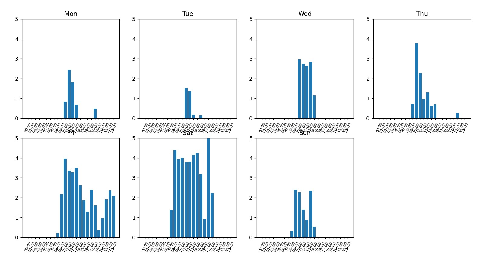

Fig 3.9: Separate bar graphs of congestion against time of day, 1 for each day of the week

This is slightly easier to understand than Fig 3.9, which may have been too colorful and messy 🌈𖡎. We can see that the day with the lowest congestion levels overall is actually Tuesday, followed by Monday.

If you could not already tell from the line graph, the subplot bar graphs make it very clear that if you go to Johor on Friday or Saturday, you would most likely be met with an unpleasant jam 🚗🚙😫🚌

Let's do this for the congestion values going into Woodlands as well. Not much change in code needed, just gotta swap the '<' in `if actual_y < y:` to '>'.

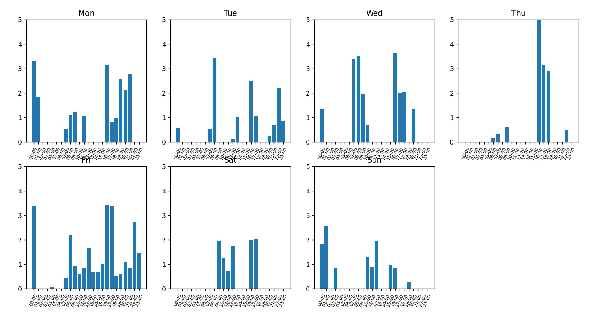

Fig 3.10: Separate bar graphs (or histograms?🤔) for congestion coming into Woodlands

As expected, there's a large influx of fellas coming into Singapore on Monday mornings from 00-00 to 01-00 for work etc 💼💻, and some from 06-00 to 09-00 for what I assume is school 📚🎒. There is also plenty of congestion on Fridays for most of the day, from people who want to spend their weekend in Singapore perhaps?

One strange thing I noticed was the unusually high congestion rate on Thurday afternoons 🚙🚗💨, not sure why there so many people coming in on a workday in the middle of the week. 

Edit: Afterwards I found out that some states of Malaysia starts their weekends on Fridays, so our 'Thursday' is like their 'Friday'. 

> This means their 2 day weekend consists of Friday and Saturday. Apparently it is a common practice for some muslim-predominant states such as Afghanistan 🇦🇫, Saudi Arabia 🇸🇦, and Dubai 🇦🇪, although Dubai phased out this practice in 2022. That's cool, I learnt something new today. 

As for other days such as Tuesday and Wednesday occasionally having periods of high congestion coming into SG, I'm not quite sure what is the reasoning behind it. My best guess is transport of company and business goods, but I could be wrong 🚚🚛📦.

These graphs may not present ground-breaking discoveries, but they do show some trends and patterns that we did not know before, and they definitely gave us some food for thought going into the next Chapter of the project: Machine Learning

🥗🍗😋🍽️ --> 🧠 ദ്ദി(˵ •̀ ᴗ - ˵ ) ✧

## Chapter 4: Machine Learning
### 4.1: One-hot encoding, sin-cos encoding, and Linear Regression model

The code in this chapter can all be found in [Predicting_with_LinReg.py](python_scripts/Predicting_with_LinReg.py)

We don't have many variables at the moment, just day and time, but its enough for a neural network model to work with after one-hot encoding all the values. 

One-hot encoding is basically splitting up a categorical column like 'day' into other columns 📆, each column representing a particular value of 'day'. Since there are 7 days, there would be 7 'day' columns (Mon, Tues, etc).

However, I will be getting rid of 1 column to make it 6 'day' columns. This is to prevent multicollinearity, something we want to steer clear of in ML 🙅‍♂️.

I'm not an expert, but I'll try my best to explain it in simple terms. If you do want an expert's article on it, you can go [here](https://www.analyticsvidhya.com/blog/2020/03/what-is-multicollinearity/), it explains it pretty well ✍️.

Taking the 'day' variable as an example. If a particular row's day was Tuesday, the 'Tues' column would be 'True' while the rest would be 
'False'.

However, what if I told you that for another row, the binary value for the columns 'Mon, Tues, Thurs, Fri, Sat, Sun' were False ❌. By elimination, you would know that the value for 'Wed', the only column not mentioned, was 'True' ✅ without me telling you. This essentially means you can predict the state/value of an independent variable (x value in a 'y against many x' relationship) through other independent variables.

This is bad for machine learning models including NN's because, in simple terms, it makes it more difficult to detect the relationships between each individual independent variable (x) and the dependent variable (y).

Another example which I learned from a book on Linear Regression models uses a regular corporate job as an analogy. A hardworking person 👨‍💻 is likely to work longer hours than average ⏳, and hardworking people also tend to produce higher quality work 🌟. In the end, the hardworking person would probably get a pay raise 💰💰. But is the pay raise a result of A) working longer hours? or B) higher quality work? 

As for the time values, I don't have to one-hot encode them since they are numerical. However, they are **cyclical** in nature 🔄. For instance, 11pm is closer to 1am than 5am, even though 5 as a number is closer to 1 than 11. Basically the values loop around. There is a way to manage cyclical values, by using cos and sin on the values to preserve their cyclic nature, but it did not go well the last time I used it.

I tried this method of encoding in my previous Machine Learning project, a Kaggle competition, where I was trying to predict Insurance Premiums. One of the variables was 'Policy Start Date', the date the insurance was bought 🗓️. I applied sin-cos encoding on the month values (since December loops back to January), but the model accuracy decreased for some reason when tested against the test data, I'm not sure why. 

So to start, I'll train the model with no encoding for the time variable, then afterwards I'll encode it and see how it performs.

First I had to create a pd dataframe, such that each row represented an instance, so slightly different than the previous dfs we made.

```
import os
import numpy as np
import pandas as pd
from sklearn.tree import DecisionTreeRegressor
from sklearn.ensemble import RandomForestRegressor
from sklearn.linear_model import LinearRegression
```
I'm sure by now you are already familiar with the first 3 packages. The 4th and last library, sklearn, has different subpackages 📦 such as 'tree' and 'ensemble', which provide us with different machine learning models to try out and test against each other 🤖.

```
1   column_names = ['Mon', 'Tue', 'Wed', 'Thu', 'Fri', 'Sat', 'Time of Day', 'congestion_area']

2   coords_path_template = r"C:\Users\Yu Zen\Documents\Coding\Project-JBridge\GCloud\coords_"

3   df = pd.DataFrame(columns=column_names)

4   for num in range(1, 4):
5       path = coords_path_template + str(num)
6       for file_name in os.listdir(path):
7           parts = file_name.split('_')
8           date = parts[0]
9           time = parts[1]
10          day = parts[2][:3]
11          index = None
12          for i in range(len(column_names)):
13              if day == column_names[i]:
14                    index = i
15                    break
```
In Line 1 I define a list of column names, omitting one of the seven days ('Sun') to prevent multicollinearity. Also included in the list are 'time of day' 🕒, another independent variable, and lastly the dependent variable 'congestion_area'.

You have already seen Line 2 and Line 4-10, where I extract the bounding box text files 📄 and split the file names into parts.

Before that, I make a DataFrame using the list of columns (Line 3). After extracting the information from the file name, I check what is the index 🔢 of the day in the 'column_names' list (Line 12-13). I then assign the value to 'index' (Line 14) and 'break' to save time. If the day from the file name is 'Sun' and is not present in column_names, 'index' will remain as 'None'.

```
16          total_box_area = 0
17          file_path = os.path.join(path, file_name)
18          with open(file_path, 'r') as file:
19              for line in file:
20                  numbers = line.split()
21                  x = float(numbers[1])
22                  actual_y = float(numbers[2])
23                  y = 1 / (1 + np.exp(4 * (x - 0.73)))
24                  if actual_y < y:
25                        box_area = float(numbers[3]) * float(numbers[4])
26                        total_box_area += box_area
27          new_row = [0, 0, 0, 0, 0, 0, int(time[:2]), total_box_area]
28            if index:
29                new_row[index] = 1
30          df.loc[len(df)] = new_row

31  max_value = df['congestion_area'].max().max()
32  df['congestion_area'] = df['congestion_area']/max_value * 5 # scaled values range from 0 to 5; 0 = no jam, 5 = very congested, then rounding to 2dp for readability
33  df['congestion_area'] = df['congestion_area'].apply(lambda value: round(value, 2))
34  print(df)
35  df.to_csv('df', index=False)
```

The code from Line 16-26 is the same as in [data_analysis.py](python_scripts/data_analysis.py), determining which side of the causeway the bounding box is on, then calculating the box area sum for that image and defining it as total_box_area.

Line 27 creates the new row of data to be added to the df. Lines 28 and 29 check if 'index' has a valid number 🔢 then replaces the correct day column value with '1' to indicate 'True' ✅, otherwise leaving everything as '0' ❌ if the day was 'Sun'. Line 30 adds the new row to the last index of the df to finish.

Line 31-33 applies min-max scaling to the congestion_area column's values. The code is basically copied from data_analysis.py, where I also applied min-max scaling except to an entire Dataframe not just a single column. Lastly, Line 35 converts the Dataframe into a csv file 📜, so I don't have to keep making the table again and again.

Here are the first 4 rows of the dataframe.
```
     Mon  Tue  Wed  Thu  Fri  Sat  Time of Day  congestion_area
0    0.0  0.0  0.0  0.0  0.0  1.0          0.0             0.00
1    0.0  0.0  0.0  0.0  0.0  1.0         18.0             2.22
2    0.0  0.0  0.0  0.0  0.0  1.0         23.0             0.00
3    0.0  0.0  0.0  0.0  0.0  0.0          0.0             0.00
4    0.0  0.0  0.0  0.0  0.0  0.0          6.0             0.00
```
The '1's under the 'Sat' column indicate that the first 3 days are Saturdays, while the absence of '1' in any of the day columns indicate that the last 2 rows are Sundays. The hour of the day can be found in the 'Time of day' column 🕒, and the relative congestion value (scaled from 1 to 5), can be found under the last column 🚙🚗💨

One thing I'm uncomfortable with though, is the lack of rows with congestion_area values > 0. After printing `len(df)` and `len(df[df['congestion_area'] > 0]), which output the total number of rows and the number of rows with a congestion value thats not '0', I got 143 and 517 respectively. The days with congestion are severly underrepresented, with the distribution of y values are imbalanced and skewed towards 0.

This can lead to the ML model leaning towards the skew as congestion values of '0' are much more frequent in the training data. To get around this, I'll be removing some of the rows with congestion value '0' 🗑️ at random so that the rows with congestion_area > 0 are not so outnumbered. We all know getting rid of data is a waste, especially when we have so little of it here, but in this case I feel its gotta be done 😕.

```
31  df.sort_values(by='congestion_area', ascending=False, inplace=True)
32  df = df.iloc[:293]
```
First I sort the rows by the 'congestion_area' column in ascending order, so all the rows with congestion values > 0 gather at the top of the df (Line 31).
Since there are only 143 rows with a positive congestion value, I want the number of rows of 0 to be about the same, so I decided to keep 150 '0' rows. So total number of rows is now reduced ⬇️ from 517 rows to (143+150) = 293 rows.

Now we can train our first machine learning model, starting off small with a simple linear regression model 📈
 ```
33  y_column = df.pop('congestion_area')
34  model = LinearRegression()
35  model.fit(df, y_column)
```
In Line 33, I removed the y_variable column from the df and defined it as y_column. Next I defined the machine learning model we would be using (Line 34), then trained the model with the x and y variables 🏋 by calling model.fit() (Line 35).

Making a default linear regression model is actually super simple, its the tuning of hyperparameters that requires expertise 🔧. For now I'll leave the hyperparameters as default.

Since I don't have enough training data to further split it into train and test data, I'll be using a mix of pictures 🖼️ (21 images) I scrounged from the other unannotated snaps folders to form the [test_snaps](GCloud/test_snaps) folder. I hand picked the photos to ensure we had a good variety of pictures with varying degrees of congestion, now we gotta convert them into a test dataframe.

```
36  test_df = pd.DataFrame(columns=column_names[:-1])
37  test_snaps_path = r"C:\Users\Yu Zen\Documents\Coding\Project-JBridge\GCloud\test_snaps"
38  for file_name in os.listdir(test_snaps_path):
39        parts = file_name.split('_')
40        date = parts[0]
41        time = parts[1]
42        day = parts[2][:3]
43        index = None
44        for i in range(len(column_names)):
45            if day == column_names[i]:
46                index = i
47                break
48        new_test_row = [0, 0, 0, 0, 0, 0, int(time[:2])]
49        if index:
50            new_test_row[index] = 1
51        test_df.loc[len(test_df)] = new_test_row
52  test_df.to_csv('test_df', index=False)

53  predictions = model.predict(test_df)
54  test_df['congestion_prediction'] = pd.Series(predictions)
55  print(test_df)
```

In Line 36, I created the test Dataframe, which is similar to the train data except I don't add the 'congestion_area' column, which is what the model will be predicting for us 😎

Line 37-47 were copied from the above code (getting pics from the coords folders), except this time the folder path (Line 37) is different. I define the row to add to the df 📝 in Line 48, with only 7 values instead of 8 in the training df. Line 49-51 is the same as above, except I add the row to the test_df, not df. 

Finally, we generate the predictions on the test data (Line 52) and append it to the end of test Dataframe as the final column (Line 53). Let's print out the results 📋 (Line 54) and compare them with the images 🔎🖼️

Here are the first 5 rows of test_df:

```
    Mon  Tue  Wed  Thu  Fri  Sat  Time of Day  congestion_prediction
0     0    0    1    0    0    0            6               0.768147
1     0    0    1    0    0    0            7               0.836279
2     0    0    1    0    0    0            8               0.904411
3     0    0    1    0    0    0            9               0.972543
4     0    0    1    0    0    0           10               1.040674
```

If you look at the first 5 pictures in [test_snaps](GCloud/test_snaps), you will see they all have very little 🤏 or no jam at all on the road to Johor. The linear regression model somewhat predicts this with congestion values ranging between 0 to 1, albeit a bit higher than I'd like since the correct value is 0.

Now lets take a look at some other rows with different days and times.

```
    Mon  Tue  Wed  Thu  Fri  Sat  Time of Day  congestion_prediction 
7     0    0    0    1    0    0            8               0.327395
8     0    0    0    1    0    0            9               0.395527
9     0    0    0    1    0    0           10               0.463658
10    0    0    0    1    0    0           11               0.531790
16    0    0    0    0    0    1            6               2.113028
17    0    0    0    0    0    1            7               2.181160
18    0    0    0    0    0    1            8               2.249292
```
For rows 7 and 8, you can see low congestion prediction 🔻, which is correct. Their corresponding [picture files](GCloud/test_snaps/11-21_08-00_Thu.jpg) do not show any jam to Johor. However, rows 9 and 10, which the LinReg model also thinks has low congestion, are wrongly predicted. 

If you refer to their [picture files](GCloud/test_snaps/11-21_10-00_Thu.jpg), you will see that the road to Johor is actually as congested as it can be, so the congestion_prediction value should actually be somewhere between 4 and 5.

Furthermore, although rows 16-18 do indicate moderate congestion with values between 2 and 3, only row 17 is somewhat correct. That's because if you refer to their corresponding files, the [image for row 16](GCloud/test_snaps/11-23_06-00_Sat.jpg) has no sign of congestion, while [row 17's image](GCloud/test_snaps/11-23_07-00_Sat.jpg) has a little jam brewing up near the Johor customs at the top right. As for [row 18's image file](GCloud/test_snaps/11-23_08-00_Sat.jpg), there's already a full blown traffic jam that spans along the entire road.

Let's try again but this time we apply sin-cos encoding to the time variable.

```
df['hour_sin'] = np.sin(2 * np.pi * df['Time of Day'] / 24)
df['hour_cos'] = np.cos(2 * np.pi * df['Time of Day'] / 24)
df.drop('Time of Day')
```

From what I learnt about sin-cos encoding (I like to call it cyclic encoding, it sounds cooler but no one calls it that) is to think of it like a circle on x and y axes ⭕, so the end of the line (12am) joins up with the start (1am).

The hour_sin column gives the vertical position (y-axis value), and the hour_cos column gives the horizontal position (x-axis value). At the end I get rid of the original 'Time of day' column, so we can have a fair test to see if encoding really helps the LinReg model perform better.

Let's compare the congestion predictions for rows 7 to 18 now that we have encoded the time values. I'll also add the time of day and previous predictions as additional columns so we can better compare the results.

```
    Mon  Tue  Wed  Thu  Fri  Sat  hour_sin      hour_cos      congestion_prediction     Time of Day     previous_congestion_prediction 
7     0    0    0    1    0    0  8.660254e-01 -5.000000e-01               0.581194     8               0.327395     
8     0    0    0    1    0    0  7.071068e-01 -7.071068e-01               0.838372     9               0.395527
9     0    0    0    1    0    0  5.000000e-01 -8.660254e-01               1.064359     10              0.463658
10    0    0    0    1    0    0  2.588190e-01 -9.659258e-01               1.243755     11              0.531790
16    0    0    0    0    0    1  1.000000e+00  6.123234e-17               1.711023     6               2.113028
17    0    0    0    0    0    1  9.659258e-01 -2.588190e-01               1.977073     7               2.181160
18    0    0    0    0    0    1  8.660254e-01 -5.000000e-01               2.247915     8               2.249292
```
Don't be put off by the weird values in the sin and cos columns, thats just what happens when you run a number through the sin() or cos() function.

For rows 7-8, it predicted a slightly greater level of congestion, which is not a major issue, but it is still wrong since there were no jams in the photos for [row 7](GCloud/test_snaps/11-21_08-00_Thu.jpg) and [8](GCloud/test_snaps/11-21_09-00_Thu.jpg). The performance for row 18 is about the same, with both past and present predictions hovering around 2.2 when really the predicted value should be between 4 and 5.

However, the new prediction for rows 9 and 10 more than doubled its previous one 📈. Although the congestion level in the images corresponding to rows [9](GCloud/test_snaps/11-21_10-00_Thu.jpg) and [10 LINKKK](GCloud/test_snaps/11-21_11-00_Thu.jpg) should be closer to 4 or 5, its still a big improvement. It's a step in the right direction, which I'm very happy to see, so I'll use the encoded version of the time data for the rest of this project.

Additionally, for rows [16](GCloud/test_snaps/11-23_06-00_Sat.jpg) and [17](GCloud/test_snaps/11-23_07-00_Sat.jpg), which by right should have a congestion prediction closer to 0 and 1 respectively, also has some small improvements. The new congestion predictions are lower than before, especially row 16. 

Although the predictions are not spot on 🎯, it is good to note that we are using one of the simpler machine learning models, Linear Regression. With no tuned hyperparameters, its unlikely that it would predict perfectly. 

In fact I expected less, but it was able to predict about half of the test data correctly, for the most part anyway ✅. One big flaw of using this model in our case is that Linear Regression assumes a linear relationship between the independent and dependent variable, in our case being the congestion value and time/day of the week.

That is obviously not the case, as heavy congestion can happen early in the morning ☀️ as well as late at night 🌙. My assumption is that the model overfitted to the 'time' variable and was slightly biased towards the thinking that higher 'hour_sin/hour_cos' value 🔺 --> greater congestion 📈, or something along those lines.

This should be a starter model, where we are just dipping our toes into ML. Next lets try a Random Forest Regressor model 🌲, which does not assume a linear relationship and should handle non-linear patterns better than our LinReg model.

### 4.2: Random Forest (and Decision Tree) Regression

The code in this chapter can be found in [Predicting_with_RFR.py](python_scripts/Predicting_with_RFR.py).

#### Random Forest Regression
There are 2 types of random forest models as far as I know, Random Forest **Classifier** and Random Forest **Regressor**. Since we are predicting continuous values and not classes/categories, we will be using the latter.

The thing I like about random forest models 🌲 is that they consist of multiple decision trees, and their individual decision tree models only use a fraction of the total variables each. This means that for example, a tree would get the columns 'Mon, Wed, Sat', while another might get the columns 'Mon, Thur, hour_sin'. This allows the first model to find meaningful relationships between the 'day' variables and congestion instead of overfitting to the 'time' variables. 

Meanwhile, the latter model is still finding patterns between hour_sin and congestion, not just completely ignoring the column and letting its information go to waste 💩

Random forest models also have other unique features specifically to prevent overfitting and find relationships between every feature and the output. This [article](https://www.geeksforgeeks.org/random-forest-algorithm-in-machine-learning/) gives a simple introduction to random forest models, should you be unfamiliar with them. Its super easy to understand, and its the same website I learnt about and took notes on random forest models when I first started on machine learning 📚

Since we converted the training and test data into csv files earlier in Chapter 4.1, we don't need the code for constructing the Dataframes, we can just pull the df from the csv files 📄. Hence, our python script for this chapter [predicting_with_RFR.py](python_scripts/Predicting_with_RFR.py) has much less code and is simpler to navigate.

```
import pandas as pd
from sklearn.tree import DecisionTreeRegressor
from sklearn.ensemble import RandomForestRegressor
```
Starting off with the libraries imported, we need 🐼 pandas 🐼 for storing the data we will be pulling from the csv files 📝. Scikit-learn (sklearn for short) is a machine learning library with numerous machine learning models 🤖  as well as tools for prepping your data and evaluating outputs. However, in this chapter we will just be using the Decision Tree Regressor model and its big brother, the Random Forest Regressor model, starting off with the latter.

```
1   train_df = pd.read_csv('train_df.csv')
2   test_df = pd.read_csv('test_df.csv')

3   y_column = train_df.pop('congestion_area')
4   rfr_model = RandomForestRegressor()
5   rfr_model.fit(train_df, y_column)

6   rfr_predictions = rfr_model.predict(test_df)
7   test_df['congestion_prediction'] = pd.Series(rfr_predictions)
8   print(test_df.head(20))
```

First off, we need to get the data. Lines 1 and 2 read the csv files with the data 🗂️ and convert them into training and testing pandas dfs. Line 3 separates the congestion area column ✂️ from the original df, Line 4 defines the ML model being used, and Line 5 trains the model by calling the 'fit' method 🏋️‍♂️

Line 6 feeds the test data to the trained RFR model for it to begin its predictions, while Line 7 attaches the predictions column to the end of test_df. Lastly, Line 8 prints the first 20 rows of test_df, although I'll only show the relevant rows here. I'll also manually add the 'Time of day' and LinReg model results as the last 2 columns 📝

```
    Mon  Tue  Wed  Thu  Fri  Sat      hour_sin      hour_cos  congestion_prediction     LinReg_results (with sin-cos encoding)  Time of Day
7     0    0    0    1  0    0    8.660254e-01 -5.000000e-01               0.090114     0.581194                                    8
8     0    0    0    1  0    0    7.071068e-01 -7.071068e-01               0.802815     0.838372                                    9
9     0    0    0    1  0    0    5.000000e-01 -8.660254e-01               2.897047     1.064359                                    10 
10    0    0    0    1  0    0    2.588190e-01 -9.659258e-01               1.945836     1.243755                                    11
16    0    0    0    0  0    1    1.000000e+00  6.123234e-17               0.631085     1.711023                                    6
17    0    0    0    0  0    1    9.659258e-01 -2.588190e-01               1.477880     1.977073                                    7
18    0    0    0    0  0    1    8.660254e-01 -5.000000e-01               3.377438     2.247915                                    8
```
Immediately we can see some improvements. If you remember, the images for rows [7](GCloud/test_snaps/11-21_08-00_Thu.jpg) and [8](GCloud/test_snaps/11-21_09-00_Thu.jpg) are devoid of cars on the road to Johor, so the congestion value should be closer to 0. We can see that the RFR model has predicted a smaller value for both rows 📉, especially row 7 with only 0.09 👍

Furthermore, take a look at rows 9 and 10. They both have increased 🔺, but row 9 has a congestion value of 2.89, really high! And true enough, the image for [row 9](GCloud/test_snaps/11-21_10-00_Thu.jpg) has a traffic jam spanning along the entire length of road, same for [row 10](GCloud/test_snaps/11-21_11-00_Thu.jpg).

But heres where it gets **really** good. Line 16 shows a prediction value of 0.6, which is true if you look at the corresponding [image](GCloud/test_snaps/11-23_06-00_Sat.jpg), no jam. Look at Line 17, which indicates the startings of a traffic jam with a not too high but not too low congestion value of 1.47. What do you see in the [image](GCloud/test_snaps/11-23_07-00_Sat.jpg)? At the top right, you can see some cars starting to pile up and form a small jam 🚗🚙, near the entrance to the Johor customs!

Now for the grand finale, Line 18, coming in with the highest value we have seen yet at 3.37 arbitrary units 📈. A near perfect prediction, as the jam in the corresponding [image](GCloud/test_snaps/11-23_08-00_Sat.jpg) has fully taken form and now snakes the entire stretch of road between the customs of the two countries.

I would have liked for some of the rows congestion values, especially row 10's, to be higher 🔺, since the magnitude of the jams in their corresponding images look like 4s or 5s. However, thats my fault for drawing the bounding boxes of varying sizes, causing their areas to defer greatly. I should have known that bounding boxes are for identifying objects and not meant to be used in the way I am using them now.

I think from now on, I will just rate the congestion situation on a scale from 1 to 5 without drawing bounding boxes, based on how many fifths of the causeway the cars take up. It won't be as cool as using CVAT bounding boxes and the object detection model YOLO 🤖, but I think this is the right choice. It will lead to more consistent congestion values and take up less time ⏳. Sometimes the simplest option is best.

#### Decision Tree Regression
Unless I was trying to create a model that I could easily understand its regression process, or save a miniscule amount of computational space 💻, I probably would not pick a decision tree regressor model 🌲 over a random forest regressor model 🌲🌲🌲. However, I do want to see how the Decision Tree Regressor model fares against its more robust counterpart, the Random Forest Regressor model, and see how large the difference in predictions are, if any.

```
19  test_df = pd.read_csv('test_df.csv')
20  dtr_model = DecisionTreeRegressor()
21  dtr_model.fit(train_df, y_column)
22  dtr_predictions = dtr_model.predict(test_df)
23  test_df['congestion_prediction'] = pd.Series(dtr_predictions)
24  print(test_df.head(20))
```
In Line 19 we re-define a new test_df since the previous test_df already has the prediction column appended to it. Line 20-24 are the same as Line 4-8 above, except with a DTR model 🌲 this time. The code in this chapter is very similar to that in Chapter 4.1, its just much simpler to understand now that we don't need to code the data preparation 📝. Same as before, I'll add the RFR's results column and 'Time of Day' column to the new test_df.

```
    Mon  Tue  Wed  Thu  Fri  Sat      hour_sin      hour_cos  congestion_prediction     RFR_prediction      Time of Day
7     0    0    0    1    0    0  8.660254e-01 -5.000000e-01               0.000000           0.090114          8
8     0    0    0    1    0    0  7.071068e-01 -7.071068e-01               0.595000           0.802815          9
9     0    0    0    1    0    0  5.000000e-01 -8.660254e-01               3.165000           2.897047          10
10    0    0    0    1    0    0  2.588190e-01 -9.659258e-01               1.905000           1.945836          11  
16    0    0    0    0    0    1  1.000000e+00  6.123234e-17               0.000000           0.631085          6
17    0    0    0    0    0    1  9.659258e-01 -2.588190e-01               1.160000           1.477880          7
18    0    0    0    0    0    1  8.660254e-01 -5.000000e-01               3.675000           3.377438          8
```
Now this is interesting. The single decision tree regressor model correctly predicts that there is no jam for row 7, predicts a lower value than the RFR model for row 8 ⬇ and predicts a higher value for row 9 ⬆️, all of which are improvements 🥳. Not sure why all the models think there is a decrease in congestion at 11am, but both models predict a value around 1.9, so thats a draw between the two models.

For the Saturday rows, it again correctly predicts no jam at 6am for row 16, predicts a small build up of congestion similar to RFR model in row 17, but the DTR prediction is less which I feel is more accurate 🎯 refer to the [row 17 image](GCloud/test_snaps/11-23_07-00_Sat.jpg) and see if you agree. Lastly, it predicts a higher congestion value for row 18, which is also an improvement since the full blown congestion in [row 18's image](GCloud/test_snaps/11-23_08-00_Sat.jpg) should have a value between 4 and 5. 

That makes it 6 rows in favour of the decision tree regressor model and 1 row which ended in a draw, a clear win for the DTR model 🥇.

But why? Isn't the RFR model, which averages the output from multiple decision trees 🌳🌳🌳 generally considered 'superior' to the single DTR model, which only consists of a single 🌳 decision tree?

What I think has happened is that the DTR model has overfitted more to the data, hence the values it outputs are more 'extreme', closer to zero when there is no jam and closer to 5 when there is jam. While the DTR model performs better when trained on our tiny training dataset of 293 training rows, it might perform worse as the dataset increases into different periods of the year 🗓️ and overfitting becomes a larger problem 🚩.

We only have the data for 2 months, so overfitting to the congestion patterns in these 2 months may not pose a problem for now, on the contrary even producing more accurate results as we have just seen. But as we gather data from other months and people using the causeway start to change their behaviour, overfitting to unique details instead of generalising to the large dataset will be detrimental to the output ⚠️. 

Put it this way, right now the overfitted model will have more accurate output. But for a larger dataset, although the model that generalizes (in this case the RFR model) will not have output that perfectly matches the actual outcome, it will definitely be closer to the right answer than whatever the overfitted model outputs.

I like the way the model is performing so far. However, every good machine learning engineer knows that an ML model is only as good as the data its fed, no matter how well the model is configured and tuned ⚙️. So before we get into the nitty gritty tuning, lets work on feature engineering 🔧.

### 4.3: Feature Engineering (in progress, tbc!)

I'd like more variables for Machine Learning than just day 📅 and time 🕓, so in this subchapter I'll be trying to come up with more. Variables are kind of like clues for an ML model; the more you have, the more accurate the output prediction.

We could add month, but we barely have 2 months worth of processed data, so I'll hold off on that until we have data from more months. Another variable I'm considering is public holiday/presence of public holiday 🎄🧧🍊. I say presence because people tend to travel a few days before or after the actual holiday, not just on the day itself. Our processed data happens to fall on the school holiday/Christmas period 🎅🏻🎁, so lets start with this variable.

First I'll identify the school holiday periods for schools in Singapore in 2024 📚🏫


Fig 4.1: School holiday periods for JCs, as well as primary and secondary schools

Looks like aside from 16th-23rd November, the holiday period of all 3 types of education institutions perfectly align, so I'll set the generic year end 'sch hols' period to be from 23rd November to 31st December. Let's take a look at the holiday periods for the polytechnics of Singapore that overlap with the dates of our web-scraped image data.


Fig 4.2: Temasek Polytechnic's holiday schedule 


Fig 4.3: Singapore Polytechnic's holiday schedule 

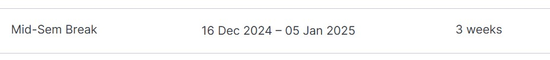

Fig 4.4: Nanyang Polytechnic's holiday schedule 

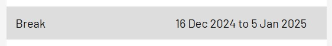

Fig 4.5: Ngee Ann Polytechnic's holiday schedule 

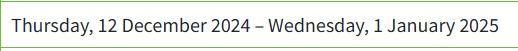

Fig 4.6: Republic Polytechnic's holiday schedule

As we can see, the holiday periods of polytechnics mostly overlap between early/mid December 2024 to early Jan 2025, so i will set a general polytechnic holiday period from 12 Dec - 1 Jan 🗓

We can feed this information to our machine learning model as binary columns ✅❌, 

for example: `column name: 'within sch hols period'` , `values: True/False.`

As for public holidays, the only public holidays we should be concerned with given our current data are 25th Dec 2024 🎅🏻🎄, which is Christmas on a wednesday, and 1st Jan 2025 🎇🥳, New Year's which is also on a Wednesday. 

My plan is to have a 'proximity to Christmas' and 'proximity to New Years' column (or make them both into a 'public hols' column, not a bad idea too), which shows the number of days between the date of the image 📆 and the public holiday 🎉. To make things simpler, I'll cap the number at '7' days away, so if the date is more than 7 days away, the value in that column would still be 7.

Another idea i have for a column is 'amount of jam in the previous hour' or previous few hours. An instance is likely to have a jam if there was already a build up of cars in the previous hour/hours 🚙🚗💨. This is known as 'lagging', which we can implement using the 'shift' function from pandas. Below is a visual example with all the new columns I'm planning to add.

(please view in landscape/horizontal screen, otherwise the table will look kinda funny)

```
    ...     Time of Day     sch hols period     poly hols period    days to X'mas               days to NY     congestion_value     previous_hour  
0   ...     23              False               False               7 (actually 33 days away)   7              2.0                  NaN  
1   ...     0               True                False               7                           7              5.0                  2.0  
2   ...     1               True                False               7                           7              3.0                  5.0  
3   ...     2               True                False               7                           7              0.0                  3.0
```
I know I suggested it, but the 'days to X'mas' and 'days to NY' column having continuous values does not really sit right with me. I'm worried that since the value '7' represents so many rows (out of 365 days, 351 days are **not** within 1 week of Christmas), the ML model may get confused by the large variance in congestion levels for a single value of 7 (๑﹏๑//)

Another potential idea I have for those 2 columns is making them into binary columns ✅❌. So when the date does fall within 1 week of the public holiday, the value would be True, and vice-versa.

I'll stick with this design for now. But after training and testing the ML model with it once, I will train it again with the 2nd design I just mentioned, and see which yields more accurate predictions.

So far, the independent variables we have are:
1) time of day 🕒
2) day 🗓️
3) whether the date is within sch hols period 📚🎒
4) variable 3 but for poly
5) days to Christmas 🎅🏻🎄🎁
6) days to New Years 🎆🍾🥳
7) previous hour's traffic 🚙🚗💨

When fed to a machine learning model, hopefully the model can identify meaningful patterns between them and the congestion level of the target road. Lets start prepping the data of the 6 columns into a training dataframe 📝

We have already been able to extract the 1)time of day and 2)day of the week in our previous data analysis, now we need to extract the date and compare it with holiday dates 🎉🗓 to get the 3rd to 6th variable values.

chapt 4.3 TBCC!

### 4.4: Model Tuning (tbc)

## Chapter 5: Automation and Website Making
### 5.1: Making HTML & CSS(styles.css) for Frontend
Quite excited for this, I've always admired aesthetic looking websites and have a couple ideas for one in mind. That said, I only have very minimal knowledge of HTML from scraping websites, and no experience whatsover with CSS. However, a friend of mine said its quite easy to pick up, so I'll be drafting up some website design prototypes on Canva while learning HTML & CSS at the same time.

Here is what I came up with:

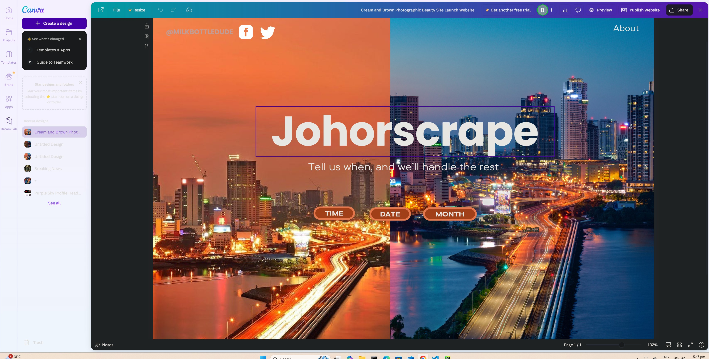

Fig 5.1: Canva website draft

Ideally, this is what I want the user to see as soon as he enters the website. No fluff and straight to the point, with a pretty background of the causeway, in the afternoon on the left 🌇 and night on the right 🌃.  I did this to try and push the idea of "same causeway, different time".

I'm no artist, but I think it looks nice :)
 

You can see the orange rounded-edge boxes with date, time and AM/PM. In the actual HTML website, those would be the buttons where u can select the date and time 📲.

I also intend to add a 'How to Use' guide 📘 below as you scroll down (with the background not moving as you scroll cuz damn that looks cool), but for now this will do. Now its time to churn this out in HTML for our actual website frontend.

Update: The first version of the HTML for the website is done! Let me take you through it, starting with the <head> tag.

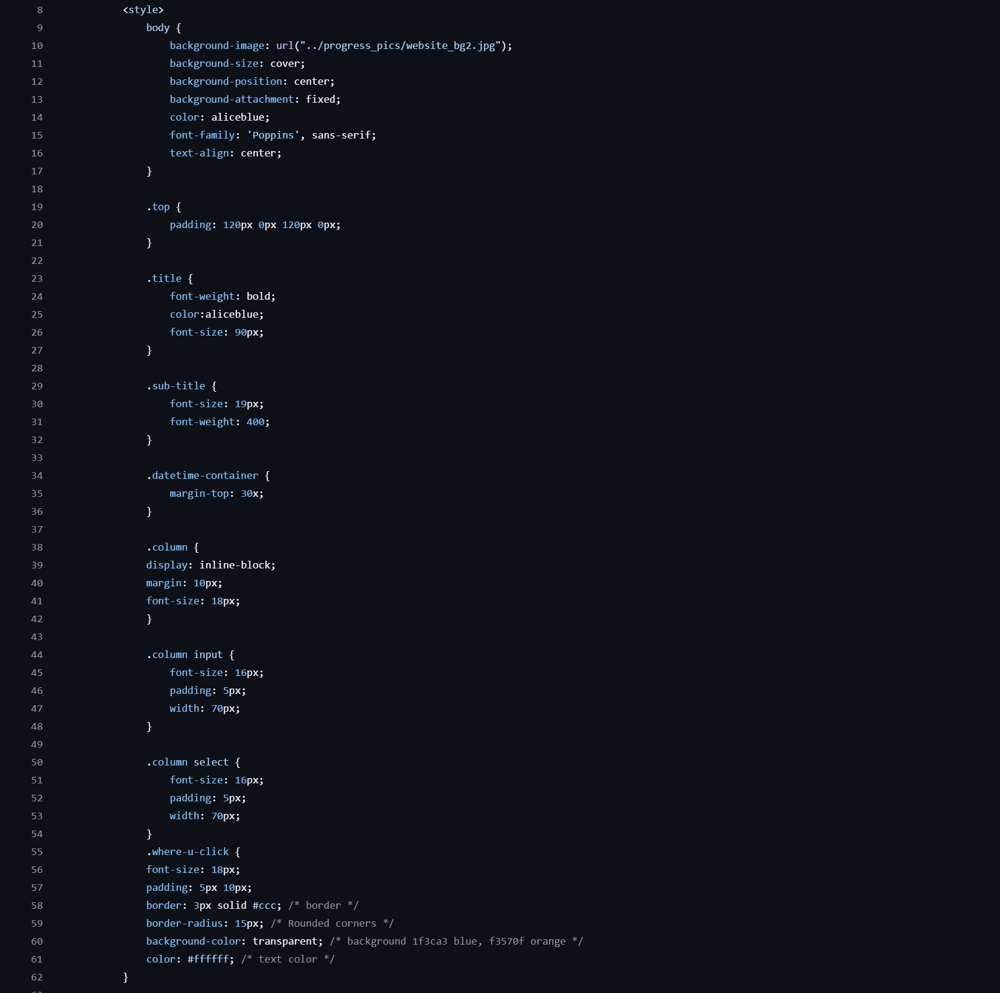

Fig 5.2: Styling portion of HTML version 1

The head tag contains the CSS for the website, although I'll probably be moving this to a separate CSS file moving forward 📁 to make the HTML file easier to read. This is very beginner CSS 👶🏻, nothing too fancy, so I wont go into everything in detail. 

I defined the [background](progress_pics/website_bg2.jpg) for the body (basically the entire website) in Line 10. Then I made the <body> element have all its elements inside align to the centre (Line 16). For the font colour I chose 'Alice Blue', but its really just white basically ⚪ (Line 14).

For the top class (Line 19), it contains all the text in the website, which is just the title as well as the little slogan right below it. I wanted them to be well separated ↕️ from the top of the screen as well as the buttons to select the date and time, hence it has a top and bottom padding of 120px. The <body> is already aligned to the center, so theres no need for side padding.

For the column class (Line 38), i wanted the date and time buttons to be side by side like in the Canva draft, so I added 'display: inline block' in Line 39. This makes the elements with class be side by side 📅🕒 instead of having a new row for every element. The column class is nested in <body>, so the buttons are aligned to the center.

The "where-you-click" class is exactly that, its the class for the elements which you click on 👉🔘, the date and time buttons. I added a slightly grey border (Line 58) to the transparent button (Line 60). I rounded the button corners (Line 59) for a more aesthetic look and made the text colour white, although thats probably not necessary since I already defined a whitish text colour in <body>.

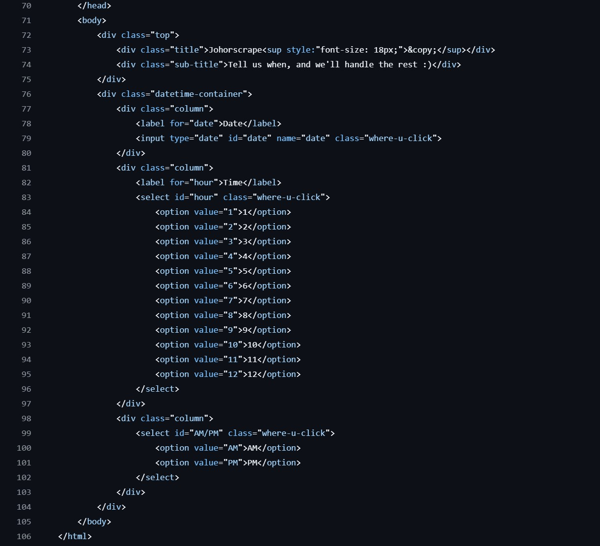

Fig 5.3: 2nd part of HTML version 1

Moving on from CSS to the actual HTML, I created the first of the 3 🔘🔘🔘 input buttons in Lines 77-80, 'Date'. The input type "date" makes it such that when clicked 👆, it produces a calendar 🗓 where you can pick a date. 

The time button is made in Lines 81-97 🕓. The "select" tag gives the dropdown rows when the button is clicked to reveal the possible time values you can pick 👆, which are defined in the <option> tags. The AM/PM button is similar, except with only 2 options. 

I did not give it a label for aesthetic purposes ✨, as you can see in Fig 5.2 below theres no AM/PM label next to the button. Also the AM/PM dropdown values after clicking make it kinda self explanatory.

All this gives us this frontend output:

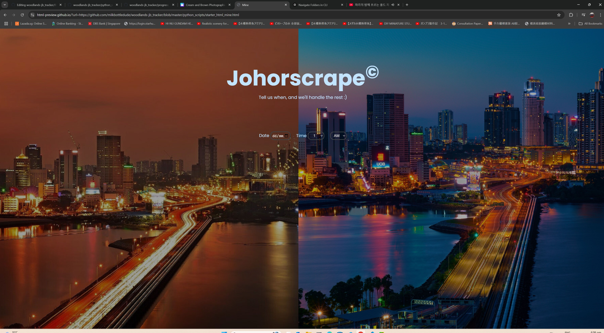

Fig 5.4: First prototype of website's HTML.

The HTML file for our website can be found [here](GAE/templates/starter_html_mine.html) 📂, although its contents may be changed throughout the project as I learn more HTML & CSS and make improvements. I'll also be making a [CSS file](GAE/static/styles.css) to separate the styling content from the actual HTML. The CSS and other static files such as jpeg files will be stored in the [static folder](GAE/static).

### 5.2: Creating Backend with Flask, main.py, and then app.yaml
With a rough version of the html and css files ready, we can shift our focus to the backend of the website ⚙️.

To start, lets make main.py 📝 which will set up Flask as well as control what will be outputted back to the user 📤. For now, we won't be outputting any ML predictions, just printing back out the input date 📆 and time 🕒 given by the user. 

I want to make sure the actual html and main.py work together seamlessly to properly output data before I bring in joblib files and machine learning models.

```
1    from flask import Flask, render_template, request

2    app = Flask(__name__)

3    @app.route('/')
4    def home():
5        return render_template('index.html')
```
First, I import Flask, the foundation of our web application build 🌐 . It will provide the necessary tools we need to properly set up our website 🔧, such as render_template and request. 

"render_template" is used to load in HTML files together with their css, as well as any variables you want to pass to it. "request" allows us to obtain any data inputted 📥 by the user on the website, such as date or time.

In line 3, the '/' represents the root url. It means that the following function `home()` will define the "main page" of the website, basically what will greet a user the first time he/she enters the website.

The main function itself is very simple, just a single line (Line 5). It displays the html page with its css 📰 without any variables (since the user just entered the website, they have not submitted any input).
```
6    @app.route('/predict', methods=['POST'])
7    def predict():
8        date_value = request.form.get('date')
9        time_hour = request.form.get('hour')
10       ampm = request.form.get('ampm')
11       return render_template('index.html', date=date_value, hour=time_hour, ampm=ampm)

12   if __name__ == "__main__":
13       app.run(debug=True)
```
In Line 6, the '/predict' means that when the html button, which is of type=submit (i'll show the updated html later), is clicked 👆, '/predict' is appended to the end of the url 🔗 and the function in Line 7 is called. The user input is obtained (Lines 8-10) before the html file is rendered, but this time with the relevant variables 📅🕒 (Line 11).

The 'POST' method is specified in Line 6 so that only POST requests trigger the predict() function. It is one of 2 request methods and is meant for requests that include transferring of data 📲 to the backend. Thats why predict() is called when a button of type=submit is clicked, since it sends input data.

I also changed the html file abit. Before, the html file only had to display the buttons 🔘, it did not actually have any backend or output. It was essentially a skeleton of the website 🦴. I'll explain the parts which were added, not the whole thing since I already explained the bulk in [Chapter 5.1 LINKKKKKKKK](0)

```
1        <div class="top">
2            <div class="title">Johorscrape<sup style="font-size: 18px;">&copy;</sup></div>
3            <div class="sub-title">Tell us when, and we'll handle the rest :)</div>
4        </div>
5        
6            <p>Date: {{date}}</p> <p>Time: {{time}} {{ampm}}</p>
7            <p>Prediction: {{pred}} units</p>
8        
9    <form action="/predict" method="POST" class="datetime-container">
10           <div class="column">
11               <label for="date">Date</label>
.
.
.
56                   <option value="PM">PM</option>
57               </select>
58           </div>
59           <button type="submit">Submit</button>
60    </form>
```
Lines 5-8 and Line 59 were added after creating main.py, for the output returned by main.py as well as to pass input data to the backend respectively.

The  is basically a python 'if' statement but in HTML and Flask syntax. This is so that the output is only shown 📰 if theres a valid 'date' input from the user. Why did I not include 'if time' and 'if AM/PM'? 🤔 Because they already have a default value, so its impossible to submit input without a valid 'time' and 'AM/PM' value.

I actually learnt this  stuff from chatgpt, not from a book or man-made resource, which might be frowned upon by some. But as long as it gets the job done and I understand exactly how it works, as well as how to use it, I don't see a problem. 

Me personally, I draw the line when the code is completely AI made, or 90% and the other 10% is just changing of variable names and other minor knick-knacks. But who gives a toss what I think hmm?

Anyway, here's the 1st website test run, I ran it using 'python main.py' on the Google shell terminal. This is just a test run on a local port to make sure everything runs fine, more refinements will be made over time. 

insert vid here

Fig 5.5: Website test run, output printed is the input date and time

As you can see, the website mechanisms work just fine, no edge cases (so far) that cause the website to glitch out or crash. Its quite a simple website so far, so that ought to be the case. The data can be input by the user smoothly, the UI is easy to understand, and the output is printed out quickly after the submit button is pressed. The input and output aesthetics could do with some work though.

This is not run on GAE yet, that requires the app.yaml file which we will create and go over later on. 

One thing I'm slightly annoyed with is that, after submitting your input, typically you would refresh the page to submit another input, another date an time. However, when I refresh, the website stores the data from before and continues to output the previous output. To actually clear the previous input and start afresh, you have to click the submit button again.

I tried using sessions.pop('date') after the output was returned, which is supposed to make the website 'forget' the previous input data, to no avail . I also tried , because by right a page refresh is a GET method not a POST, but after checking the logs I realized: a refresh of a page which was loaded in via a 'POST' is still a 'POST' request, not 'GET'. 

Its not a major flaw, but its still a little annoying. I hope to find a solution to this, but now I'll move on with the rest of the website build. Theres bigger fish to fry, now is not the time to fret over this small stuff.

Now that we know the frontend is able to send input data to the backend, and the backend can send output back without any hiccups, we can focus more on what **kind** of output we want to be sent. Obviously, not just the date and time like before, but also the prediction value.

And perhaps I'll add an image of what the congestion situation will likely look like, in case the prediction value is not enough to convey how severe the traffic jam will be to the user. Yea I think I'll add some annotated pictures to the [static/](GAE/static/) folder, stay tuned for this.

arbitrary units alone wont be able to convey how congested the road will be

However, we don't want to be training the ML model again and again every time a user sends in their input. That would waste a lot of time, is computationally expensive, and overall a very stupid way to set up the website. Furthermore, we would need to have the training data on hand all the time, which would take up a lot of space. So instead, we will train the model beforehand **once**, then store the trained model's weights for later use.

This is where the joblib package comes in handy. With just one line of code, we can save the model's weights after training. The following code is from [Predicting_with_RFR.py](python_scripts/Predicting_with_RFR.py), the only change is the joblib line.

```
# Random Forest Regressor model
rfr_model = RandomForestRegressor()
rfr_model.fit(train_df, y_column)
joblib.dump(rfr_model, "rfr_model.joblib") # NEW LINE, saving rfr weights for App Engine

rfr_predictions = rfr_model.predict(test_df)
```
After saving the weights in a joblib file named rfr_model.joblib, I can move this file to the 'johorscrape_website' project folder in GCloud shell editor together with the rest of the files. Now we can reference it whenever we have to make a prediction, without having to train a fresh model every time.

As of right now, this is how the project folder's file structure in the gcloud shell editor is looking:
```
/johorscrape_website
    |── myenv/
    |   └── packages, libraries, etc
    |── app.yaml
    |  
    |── static/
    |   └── website_bg2.jpg
    |	└── 1_jam.jpg
    |	└── 2_jam.jpg
    |	└── 3_jam.jpg
    |	└── 4_jam.jpg
    |	└── 5_jam.jpg
    |	└── styles.css
    |	└── mobile.css
    |	└── website_bg2.jpg
    |	└── website_bg.jpg
    |  
    |── templates/
    |  └── index.html
    |  
    |── main.py
    |  
    |── requirements.txt
    |    
    |── rfr_model.joblib
```
Starting off with `myenv`, thats the virtual environment (venv) that stores all the installed libraries listed in requirements.txt, the second last file near the bottom of the project folder. Its only necessary for test runs with `python main.py` though, GAE has its own environment to store the downloaded libraries for public website deployment.

`app.yaml` contains code which configures how GAE deploys our website. Right now its still an empty file, but we will get to it once we need to deploy the website publicly.

The `templates/` folder contains the main html file, index.html. I'm not too sure why i need a whole folder just for one file, but this is apparently how website files should be formatted, with css files inside static/ and html files inside templates/.

`main.py` as you know contains the backend for our website, and `rfr_model.joblib` contains the weights of our pre-trained random forest regressor model.

The `static/` folder contains all the css files, as well as image files which I intend to output in the website, such as background images. The {number}_jam.jpg files are pictures of the causeway at different levels of congestion, with 1 meaning 'no jam' to 5 meaning 'chock full of cars'. 

You may notice that there is one more css file, mobile.css. Its basically the same as styles.css, but for if someone opens the website through their mobile phone, or a device of different dimensions to a laptop/desktop. Why is this necessary you may ask?

So far, every time I have entered the website, it has been from my laptop, so the website is opened in landscape mode. It looks great, formatting and space between elements have been hand-tuned to perfection by yours truly. But enter the very same url in your iPhone or Samsung galaxy, and you get something that looks like this.

insert chopped formatting for fone:

Fig 5.6: How the website looks like when viewed from an iPhone 12.

As you can see, css that looks good for one device may not look as good for another. Rather, it can be pretty hideous.

This is where mobile.css comes in. Its very similar to styles.css, except I changed the (background image)[GAE/static/website_bg.jpg] to something more potrait friendly. I also edited the text sizes to make the words fit the screen sizes of mobile phones.

Anyway, after adding joblib to the project folder, we can now reference its weights in main.py and use it to properly output a prediction value. Lets see the changes in main.py.
```
...
3    import joblib
4    import pandas as pd
5    import numpy as np
...
9    rfr_model = joblib.load('rfr_model.joblib')
10   cols = ['Mon', 'Tue', 'Wed', 'Thu', 'Fri', 'Sat', 'hour_sin', 'hour_cos']
...
21          ampm = request.form.get('ampm')
22          input_df = pd.DataFrame(np.zeros((1, 8)), columns=cols)
23          date_obj = datetime.strptime(date_value, '%Y-%m-%d')
24          day_abbr = date_obj.weekday()
25          if day_abbr < 6:
26              input_df.iloc[0, day_abbr] = 1
27
28
27          input_df['hour_sin'] = np.sin(2 * np.pi * float(time_hour) / 24)
28          input_df['hour_cos'] = np.cos(2 * np.pi * float(time_hour) / 24)
29          prediction = rfr_model.predict(input_df)
30          return render_template("index.html", date=date_value, time=time_hour, ampm=ampm, pred=round(prediction[0], 3), pic_no=round(prediction[0], 0))
```
First, I imported 3 additional packages (Lines 3-5). Joblib to load in the weights from rfr_model.joblib, pandas to create an input table for the rfr_model, since we need to feed the ML model data in table format, and numpy for the π value which we use in Lines 27-28.

I load the weights (Line 9) and create a row of column names for the pandas dataframe (Line 10), after which I create the df with a single row of 8 zeros for each column (Line 22). I convert the date_value, which is the date input by the user, from a string to a datetime object (Line 23), before finding out what day of the week it is in index format (Line 24). 0 stands for Monday, 6 stands for Sunday, and I think you can figure out the rest.

Once again, to avoid multicollinearity, I did not add a column for 'Sunday'. I check if the day index is < 6. If it is, that means its not a Sunday, so I proceed to change the corresponding column value from 0 (❌) to 1 (✅) in Line 26.

i apply sin-cos encoding to the 'time_hour' value in Lines 27-28, then store the numpy array of predictions in the variable 'prediction' (Line 29).

In Line 30, I render the template and pass all the relevant variables to the html file. Some new additions include 'pred' and 'pic_no'. I round the prediction off to 3dp for pred so that the output does not look to messy, and to nearest whole number for pic_no because the jam images in [static/](GAE/static) only represent whole numbers from 1-5. 

Notice how I type 'prediction[0]' instead of just 'prediction', thats because 'prediction' itself is a numpy array. To extract the actual integer value, I have to iterate through the array.

Now let's test run this and see how the output looks like, I'll run it with just the prediction value first (Fig 5.5), then if there are no issues I'll include the jam image in the output too (Fig 5.6). You can see how they turned out below.

insert vid of with pred

Fig 5.7: Test run with prediction value included

And here it is with the image included 🖼️

insert vid of with pred and image

Fig 5.8: Test run with both prediction value and jam image included

Looks like the structure of the website is complete. Now we can finally move on to deploying this thing for real on Google App Engine (GAE) so that everyone can use it. This does not mean that the development of the website HTML and CSS will be halted though, I will continue to improve the visual and overall performance of the website as inspiration strikes and my skills continue to improve.

To run the website on GAE, we need an app.yaml file as mentioned before when showcasing the project folder structure. We already have an app.yaml file, but its contents are still empty, so let's change that.

```
1  runtime: python312

2  handlers:
3    - url: /static
4      static_dir: static/
5    - url: /.*  
6      script: auto
```
In Line 1, I specify the python version I'm using, python 3.12, which is the latest version as of the time I'm doing this project.

Afterwards, I specify some handlers. I need to reference the static/ folder for images and css files in this website, so I make sure to let GAE know (Line 3-4). In Line 6, I tell GAE to route any request in my website, regardless of POST or GET, to the backend. 'script: auto' (Line 6) tells it to auto detect the backend file, which in our case is main.py

A very basic app.yaml file, but necessary for deploying the website publicly through GAE.

Now, all I need to do is type `gcloud app deploy` in the terminal to get the website up and running. You can now access the website yourself [here!](https://sapient-metrics-436909-v6.appspot.com#1739003720204209127).


#### 5.3: Linking Backend with improved HTML in Google App Engine (GAE)
