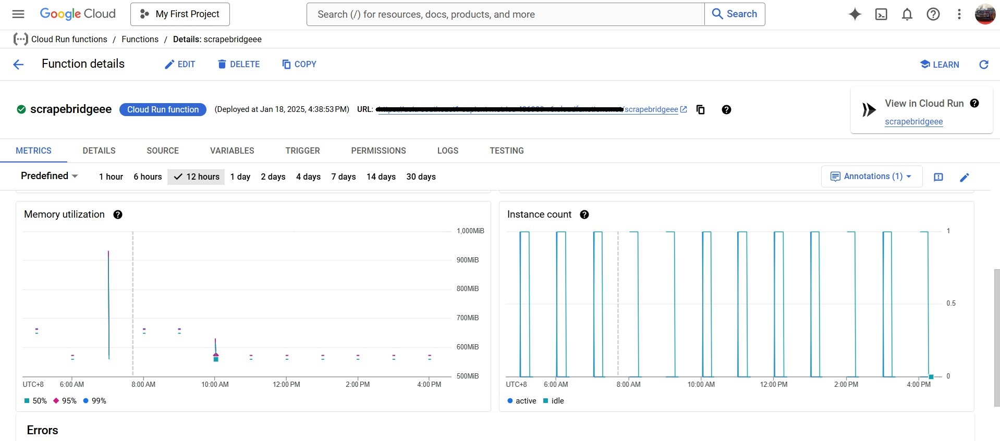
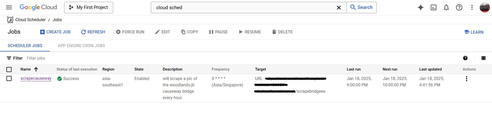
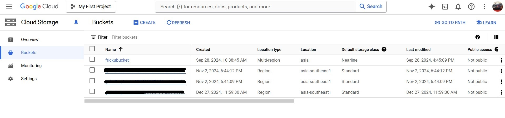
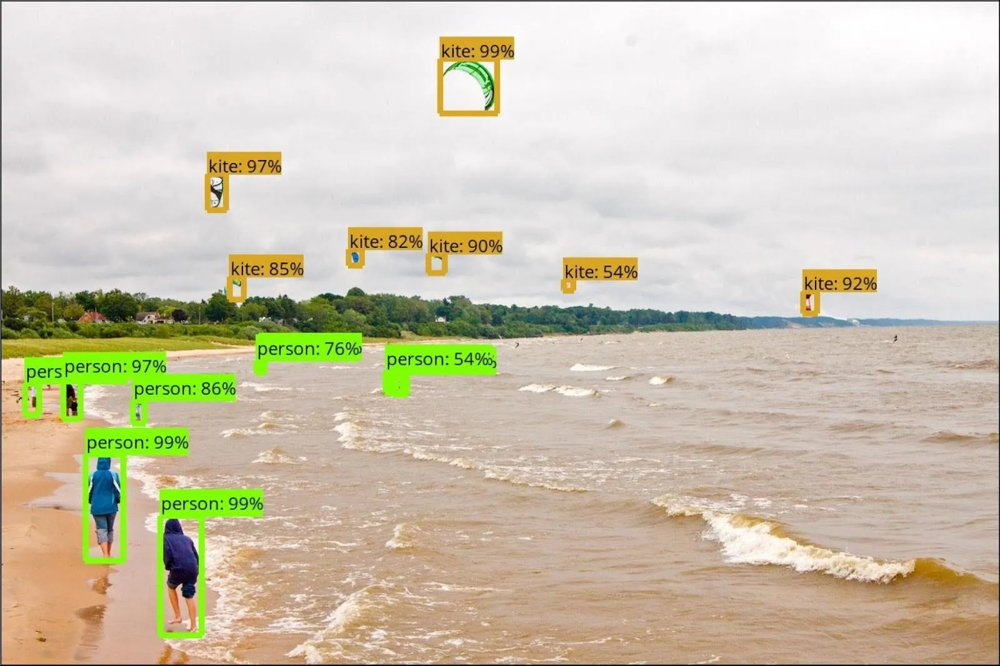
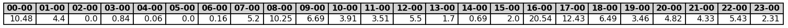
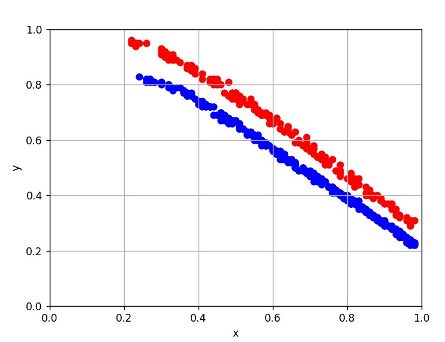

# Project: Woodlands-JB Tracker

- 🗪 Feel free to telegram me [@milkbottledude](https://t.me/milkbottledude) if you have any questions, or just want to chat :)

> TLDR: I made a [webapp](https://sapient-metrics-436909-v6.as.r.appspot.com/) on Google Cloud that uses machine learning to predict the amount of traffic on the Johor-Singapore Causeway, at a future date and time of your choosing.

Please read through the README before visiting the [webapp](https://sapient-metrics-436909-v6.appspot.com/#1739003720204209127). 

If you are interested, the [Documentation](Documentation.md) showcases the process of creating the Machine Learning 🤖 and Google Cloud backend ⚙️ of the website, as well as the HTML and CSS frontend. Feel free to take a look at that as well 📚.

## Overview 🔍
Welcome to Project: Woodlands-JB Tracker!

This project aims to predict the congestion level of the bridge at the Singapore Woodlands Checkpoint Causeway at any date and time in the future, based on variables like:
- Time of day 🕑 
- Day of the week 🌞 (i think generally wkends are more congested but we'll see what the data tells us)
- Presence of holidays (public hol & sch hol) 🏖️
- Month of the year 📅

Known as the most busiest land crossing in the world, the bridge allows cars to go to and fro between Johor, Malaysia and Singapore. It would certainly help us if we could know when the bridge was clear so that we can pop into Johor for a shopping trip, or a day out with the family without being stuck in traffic for hours.

## How To Use ❓
Simply enter a future date 📅 and time 🕑 of your choosing, as well as whether you are looking to go to Johor from Woodlands or vice versa, then click submit 🟢. 

Johorscrape will then predict the level of congestion at that moment and output an arbitrary congestion value ranging from 0 to 5. From 0, meaning no cars on the road at all 🤩, to 5, meaning the road is extremely congested 🚙😭🚗💨. 

To allow the user to better visualise the congestion level 👁️, a picture showing a rough estimate of how the causeway might look like will also be shown 🛣️.

---

Tools and libraries used in this project:

- **Google Cloud**, for automation of code running and image storage
    - Cloud Run Functions
    

        Figure I: Preview of GCloud Run Functions

    - Cloud Scheduler
    

        Figure II: Preview of GCloud Scheduler Preview

    - Cloud Storage
    

        Figure III: Preview of GCloud Storage
      
    - Google App Engine (GAE)

- **YOLO** (You Only Look Once), for object detection 
    

    Figure IV: YOLO in action on a picture of the beach

- **Selenium**, for web scraping

    You can see Selenium in action in the GIF below, with the chromedriver opening the LTA website for a split second during web scraping.
  

    Fig V: Selenium in action on LTA's traffic camera website

- **Pandas** and **Numpy**, for storing the quantified data into neat tables
    
    Fig VI: Table of relative congestion values for every hour of the day

- **Matplotlib** for visualization of data with graphs and charts.
    

    Fig VII: Graph of coordinates of bounding boxes, with each colour representing one side of the bridge.

- **Scikit-learn** for machine learning models 🤖

The full list of libraries I imported to use in this project can be found in the [requirements.txt](miscellaneous/requirements.txt) file, but do check their versions in case they are outdated.

This project will be divided into 5 chapters✋:

---

Chapter 1️⃣ : Collecting Raw Data

In order to gather raw data 🔍, we'll first use Selenium to web scrape snapshots of the bridge from the LTA woodlands causeway website at fixed time intervals ⏳. 

To automate this process, we shall write a script 💻 and dockerfile for ☁️**Google Cloud Run** ☁️to run the web scraping code directly from the cloud without the need for my laptop to switched on.

---

Chapter 2️⃣ : Prepping Images for Object Detection

With the few jpegs of the bridge 🛣️ that we have collected, we will experiment with different deep learning models for object detection, mainly OpenCV and YOLO. However, YOLO requires manual annotatation of the pictures with bounding boxes 🔲.

Unfortunately, manual annotation of thousands of cars is very tedious and time consuming ⏳, and cannot be automated until the YOlO model is sufficiently well trained to do so itself. 

Hence, i will be splitting the images up into batches for me to annotate them a batch at a time. The more batches annotated, the more training data we can feed the YOLO model, the more accurate the image detection will be.

---

Chapter 3️⃣ : Processing and Visualizing Data 

Although during this time we still will not have insufficient manually annotated images for the YOLO model, we can still process the limited number of annotated snapshots we have into scaled and interpretable data. 

The area of the bounding boxes 🔲 for each picture will be calculated and stored, then plotted into graphs and tables so that we can have a visual representation 📊 of the data, as well as a rough idea of what kind of patterns 📈📉 there are between congestion and the variables. 

---

Chapter 4️⃣ : Machine Learning

We can also do some machine learning 🤖 with the data, using sklearn models such as Random Forest Regressor 🌳 and Linear Regression 📈 to capture complex relationships between variables, and even tell how much traffic will be on the bridge at a future time and date. 

🙋‍♂️ However, the congestion status predictions may not be 100% accurate. I am not a certified ML engineer, and I don't work at OpenAI or Meta.

---

Chapter 5️⃣ : Deploying code to Website

After we have achieved an ML model with weights ⚖️ that have been trained well enough such that it can predict congestion on the bridge accurately, we can move code and weights to GCloud run and use Flask for the website's backend. For the frontend, we can use github to host a pretty HTML page for the user to interact with.

---

#### If you are still interested and would like to know more, [here](Documentation.md) is a more detailed documentation of the 4 stages.

I will be going more in depth on setting up of the code and dockerized container 📦 for the GCloud functions, the headaches and setbacks 🤕, processing of the image data into clear readable data, and more. 

I also added screenshots and pictures 🖼️ of the processes in the documentation below if you like visual learning 👁️, from boring things like manually drawing bounding boxes to more cool stuff such as experimenting with object detection ML models.

- All pictures of the project can be found in the [progress_pics](progress_pics/) folder

- The python code files can all be found in the [python_scripts](python_scripts/) folder

Hope to see you [there](Documentation.md)!. But I must warn you, its pretty dry 🏜️

