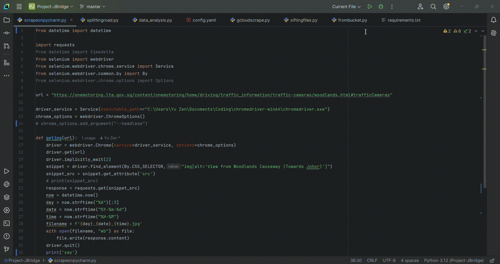

# Project: Woodlands-JB Tracker


- 🗪 Feel free to telegram me [@milkbottledude](https://t.me/milkbottledude) if you have any questions, or just want to chat :)

## Overview 🔍
Welcome to Project: Woodlands-JB Tracker!

This project aims to predict the congestion level of the bridge at the Singapore Woodlands Checkpoint Causeway based on variables like:
- Time of day 🕑 
- Day of the week 🌞 (i think generally wkends are more congested but we'll see what the data tells us)
- Presence of holidays (public hol & sch hol) 🏖️
- Month of the year 📅

Known as the most busiest land crossing in the world, the bridge allows cars to go to and fro between Johor, Malaysia and Singapore. It would certainly help us if we could know when the bridge was clear so that we can pop into Johor for a shopping trip, or a day out with the family without being stuck in traffic for hours.

Tools and libraries used in this project:

- **Google Cloud**, for automation of code running and image storage
    - Cloud Run Functions
    

        Figure I: Preview of GCloud Run Functions

    - Cloud Scheduler
    

        Figure II: Preview of GCloud Scheduler Preview

    - Cloud Storage
    

        Figure III: Preview of GCloud Storage

- **YOLO** (You Only Look Once), for object detection 
    

    Figure IV: YOLO in action on a picture of the beach

- **Selenium**, for web scraping

    You can see Selenium in action in the GIF below, with the chromedriver opening the LTA website for a split second during web scraping.
  


    Fig V: Selenium in action on LTA's traffic camera website

- **Pandas** and **Numpy**, for storing the quantified data into neat tables
    
    Fig VI: Table of relative congestion values for every hour of the day

- **Matplotlib** for visualization of data with graphs and charts.
    

    Fig VII: Graph of coordinates of bounding boxes, with each colour representing one side of the bridge.

The full list of libraries I imported to use in this project can be found in the [requirements.txt](miscellaneous/requirements.txt) file, but do check their versions in case they are outdated.

This project will be divided into 5 chapters✋:

Chapter 1️⃣ : Collecting Raw Data

In order to gather raw data 🔍, we'll first use Selenium to web scrape snapshots of the bridge from the LTA woodlands causeway website at fixed time intervals ⏳. 

To automate this process, we shall write a script 💻 and dockerfile for ☁️**Google Cloud Run** ☁️to run the web scraping code directly from the cloud without the need for my laptop to switched on.

Chapter 2️⃣ : Prepping Images for Object Detection

With the few jpegs 🛣️ of the bridge that we have collected, we will experiment with different deep learning models for object detection, mainly OpenCV and YOLO. However, YOLO requires manual annotatation of the pictures with bounding boxes 🔲.

Unfortunately, manual annotation of thousands of cars is very tedious and time consuming ⏳, and cannot be automated until the YOlO model is sufficiently well trained to do so itself. 

Hence, i will be splitting the images up into batches for me to annotate them a batch at a time. The more batches annotated, the more training data we can feed the YOLO model, the more accurate the image detection will be.

Chapter 3️⃣ : Processing and Visualizing Data (currently at this stage)

Although during this time we still will not have insufficient manually annotated images for the YOLO model, we can still process the limited number of annotated snapshots we have into scaled and interpretable data. 

The area of the bounding boxes 🔲 for each picture will be calculated and stored, then plotted into graphs and tables so that we can have a visual representation 📊 of the data, as well as a rough idea of what kind of patterns 📈📉 there are between congestion and the variables. 

Chapter 4️⃣ : Machine Learning

We can also do some machine learning 🤖 with the data, using tensorflow neural networks 🧠 to capture complex relationships between variables and even tell how much traffic will be on the bridge at a future time and date. 

🙋‍♂️ However, the congestion status predictions may not be accurate if there is little training data to learn from.


Chapter 5️⃣ : Automation

After we have achieved a YOLO model with weights ⚖️ that have been trained well enough such that it can detect congestion on the bridge accurately, we can move the YOLO code and weights to GCloud run for the annotation process to be automated 🔄 as well together with the web scraping process.

#### If you are still interested and would like to know more, below is a more detailed documentation of the 4 stages.

I will be going more in depth on setting up of the code and dockerized container 📦 for the GCloud functions, the headaches and setbacks 🤕, processing of the image data into clear readable data, and more. 

I also added screenshots and pictures 🖼️ of the processes in the documentation below if you like visual learning 👁️, from boring things like manually drawing bounding boxes to more cool stuff such as experimenting with object detection ML models.

- All pictures of the project can be found in the [progress_pics](progress_pics/) folder

- The python code files can all be found in the [python_scripts](python_scripts/) folder

Once again, feel free to skip ⏭️ to any chapters or versions that interest you 😊.

## Table of Content 📖
Chapter 1: Collecting raw data 
- 1.1: [Web Scraping](#web-scraping) 
- 1.2: [Automating Web Scraping with GCloud](#automating-web-scraping-with-gcloud) 
- 1.3: [Creating a Dockerized Container](#creating-a-dockerized-container) 
- 1.4: [Creating and Linking GCloud Bucket](#creating-and-linking-gcloud-bucket) (delete when done)


Chapter 2: Prepping Images for Object Detection
- 2.1: [OpenCV](#OpenCV) (delete when done)
- 2.2: [Annotating with CVAT](#annotating-with-CVAT) (delete when done)
- 2.3: [YOLOv8 and pain](#yolov8-and-pain) (delete when done)
- 2.4: [Increasing Training Data](#increasing-training-data) (delete when done)

Chapter 3: Processing and Visualizing Data
- 3.1: [Differentiating the Roads](#differentiating-the-roads) (delete when done)
- Stage 3.2: [Exploratory Data Analysis (EDA)](#exploratory-data-analysis-eda) (delete when done)
- Stage 3.3: [Potential Variables](#potential-variables) (delete when done)

Chapter 4: Machine Learning
- Stage 4.1: [Feature Engineering](#feature-engineering) (delete when done)
- Stage 4.2: [Training Neural Network Model](#training-neural-network-model) (delete when done)

Chapter 5: Automation
- Stage 1: [tbc](#tbc) (delete when done)


[Conclusion](#conclusion)


## 📚 Documentation 


## Chapter 1 - Collecting raw data
### 1.1: Web Scraping
Time to collect the most important ingredient in any data analysis or machine learning project: **Data**. Firstly, I import all the necessary libraries to use Selenium to scrape live data from a website:

>We need the **datetime** class, as it helps us to organize the data neatly by date and time. It also allows us to manage the date and time values which can be used during machine learning and graphing in Chapter 3 and 4.
```
from datetime import datetime
```
>We need the **Requests** library for interacting with websites and scraping them too.
```
import requests
```
>**Webdriver** works together with chromedriver.exe to create a 'robot' Google Chrome window, which you saw for a split second in the GIF above (Fig smth).
```
from selenium import webdriver
```
**Service** provides the path to the local chromedriver.exe file to Selenium
```
from selenium.webdriver.chrome.service import Service
```
**By** helps me to find the object I want to scrape by letting me key in attributes of the object so that Selenium knows what object i want to scrape.
```
from selenium.webdriver.common.by import By
```
**Options** allows us to modify the web scraping process. For example, we can run chrome in 'headless mode' by doing this `chrome_options.add_argument("--headless")`.

This allows us to carry out the web scraping task but without the chrome window popping up like you saw in the earlier GIF.
```
from selenium.webdriver.chrome.options import Options
```
- Now moving on to the actual code, starting with the function `getjpg(url)`, where the 'url' inside the brackets is the only argument of the function and is where we will pass the LTA website's url.

    

    Fig 1.1: Web scraping portion of `getjpg` function

    Let's go through each line of code one by one:

    For Line 16, we are launching the Chrome window with our custom chrome options. Line 17 then gives the url for the Chrome window to go to, followed by Line 18 which waits 2 seconds for all html elements to load.

    Lines 19 and 20 gets the snapshot of the bridge from the website using attributes and tags unique to the snapshot object, and Line 21 captures the actual image and downloads it into the current directory, the project's repository folder.

- The second part of the function focuses on the format of the image file name after downloading it, as that will be important in the later chapters for organizing and visualising of data.

    

    Fig 1.2: Constructing image file name

    Line 22 gets the day, date and time at the moment the code is run, all in a single datetime object. Lines 23, 24 and 25 split the datetime up into its day, date and time components after it is converted to a string using strftime.

    Line 26 forms the filename by using an f-string to structure the day, date, time and jpeg file extension into a neat filename. Line 27 and 28 adds the file to my laptop, and Line 29 ends the Chrome window session.


The result is what you see in Figure V, I also wrote a print() statement which displays the name of the file saved, as you can see at the bottom of the screen where my mouse is circling. This is just to confirm the naming format is correct.

The 'yay' is a another print statement i put at the end of the web scraping `getjpeg` function so I know that the code ran smoothly. 

These print statements may not look important now, but in the next subchapter where I move this code to Google Cloud Run Functions, there will be many hiccups and errors. 

I need to know at which point did the code stop working, so its important to set up logging statements here and there, which allows us to pinpoint where the code stopped based on which statements are output.

I know this is in the overview above already, but I like GIFs so ill put it down here again👍.


The web scraping script works and all, but I want to be able to automate it and not have to open my laptop every hour to run the code. In the next subchapter, I prepare my code to run in a dockerized container from Google Cloud.

### 1.2 : Automating Web Scraping with GCloud

After trying out various cloud services like PythonAnywhere and Amazon Web Services (AWS), I eventually settled on Google Cloud

One reason is because PythonAnywhere could not run Selenium chromedriver (which I only found out after paying for it 🥲). Plus I already had a Google account with billing set up prior to this project 💸, but not for Amazon. Also I don't like Jeff Bezos, but thats a story for another day.

Anyway, let's adapt this code to Google Cloud Run Functions. Google Cloud is Linux-based, so we will have to change the way the chromedriver is installed and run 🔧.

The adapted code is in [gcloudscrape.py](python_scripts/gcloudscrape.py). Very similar, but with more imported libraries and functions. Let's start with the new libraries.

```
from google.cloud import storage 
```
This library is for storing the image files to Google Storage Bucket 🪣
```
from io import StringIO
```
StringIO allows for reading of file data from a Storage Bucket without needing to download it, which requires additional code and runs the risk of having duplicate files in the Bucket afterwards 📂. 

```
import chromedriver_binary
```
As dockerized containers are Linux-based, the process of running a Chrome window using chromedriver here requires directing the chromedriver path to the directory using this method instead.

Moving on to the code:

- For the function `adddatetime(bucketname, data)`, its primary use was to write down the date and time for every web scrape session into a csv file for tracking purposes 📝. But ever since I managed to code the datetime info into the filenames, the function is not of much use anymore.

    

    Fig 1.3: `adddatetime()` function 

- The meat of the script is actually the function `scrapeaddpic()`, which not only scrapes the LTA website for the images like in Chapter 1.1, but also saves the images to the Google Storage Bucket. 

    I also added code to scrape the part of the crossing before the Singapore Woodlands Customs, as you can see in Line 53.

    

    Fig 1.4: `scrapeaddpic()` function, such an eyesore...

    You can also see I've sprinkled some print statements here and there ✨ (Lines 47, 54, 57, 60, 62, 73, & 76). 
    
    I can look back at the logs after running the code and see which statements were printed and which were not, allowing me to pinpoint where the code went wrong 🎯.

    To not bore ourselves with the nitty gritty, let's skip the parts already covered in Chapter 1.1 and go through this quickly 🧐:

    Lines 61-64 obtain the Bucket which we will be storing our image files in 🪣, and Lines 71 to 76 write the files to the bucket as 'blobs', which is Google Cloud's way of handling data for standardization purposes.

That's the main python script for Google Cloud, but theres more to automating code than just the code itself. Next we will be creating the GCloud dockerized container for the code to run in 📦.

> If you have any questions just telegram me, my @ is linked at the top. Like fr i need someone to discuss my projects with 🗿.

### 1.3: Creating a Dockerized Container

As the web scraping code will be running from the cloud without a platform like VS Code or PyCharm to execute it, we need to create whats called a "container" for the code instead with our very own [Dockerfile](GCloud/Dockerfile).


Fig 1.5: Dockerfile code

Line 8 gets the latest version of Google Chrome and Line 9 installs it 📥. Line 4 ensures that all the packages installed is the most updated version  🔄 there is, while Line 5 installs all Chrome libraries that could not be installed from the code in Line 9.

Take note that due to Line 4, the container's google chrome version will always stay updated, but the chromedriver version won't. Be sure to monitor the logs of the GCloud function 👀 and update the chromedriver binary version in requirements.txt when necessary.

Lines 12 and 13 moves our python file 🚚➡️ into the /app directory in the container 📦, and makes sure that subsequent commands like COPY in Line 14 and RUN in Line 17 will execute relative to /app. 

Line 14 copies all files that are created in the Run Function, but for some reason it was not working, so i ran the command again in Line 16 for requirements.txt. Then I installed the requirements into the container in Line 17. Finally, Line 19 runs main.py ▶️, our web scraping python file.

**Quick Reflection:** The code itself is really little, but don't let that fool you. This was the hardest part of the project 💪, and it really killed me because I had never used Google Cloud to run code or used Linux before, let alone know what a dockerized container was 📦. 

I had to borrow many 'Google Cloud for beginners' books 📖 and watch numerous tutorials 👨‍💻💢, just to get the knowledge i needed to make this little shi-

It was pretty discouraging, because the more I learnt, the more I realised how much *I didn't know*. Furthermore, some of the books and tutorials were outdated and did not work like it was supposed to, which I only realized after spending weeks trying to learn it 😩. That's probably my bad though I should have picked the more recent ones from the start.

But after 2 arduous weeks, I finally managed to get a container, with chrome and chromedriver properly installed, up and running without any problems. That was a good day, felt super accomplished.

### 1.4: Creating and Linking GCloud Bucket

take it away

## unprocessed desc, rough work
TLDR outline of project.

Stage 1: Testing to see if selenium can enter the LTA woodlands causeway website. If yes, we will try to extract the jpeg link of the woodlands checkpoint at that point in time, then download it and save it in my laptop using requests. This will all be done using PyCharm.

Stage 2: We will now be moving on to the machine learning part of the project. Using the few jpegs of the woodlands causeway bridge that were downloaded, I will attempt to use Keras, YOLO(You only look once), TensorFlow, or Pytorch to make a machine learning model that can count the number of cars on the bridge.

Stage 3: I will pick the most suitable and convenient machine learning frameworks out of those mentioned above, and utilise it in the rest of my project. Now we will be attempting to automate this whole process, from starting the code for selenium to scrape the website, all the way to counting the number of cars and saving the number in a csv file. To automate all of this, i will be using Google Cloud Run, because my broke ass cannot afford AWS. It is simply a matter of moving all the code in PyCharm to Google Cloud's code editor and editing the code to ensure it works in Google Cloud's CLoud Run.

Stage 4: After quantifying the crowdedness data of the bridge for different days and different time of days, we can visualise this data through the use of bar graphs to try and identify any patterns or relationships, as well as any hidden factors that may influence the number of cars on the bridge. 
If time permits, i will also use machine learning methods to identify patterns that i could not identify myself, either through simple linear models from sklearn or more complex models such as neural networks from TensorFlow. I will probably use the latter. After the model is reliable, not only can we use it to predict traffic conditions a few days prior, i will also use gcloud to set up a 'real time' traffic prediction, which should be more reliable as it can see the traffic of the previous few hours and make a more informed decision on the upcoming traffic condition. We could even set up an alert system to notify you on your phone when the jam will occur on the day itself.


Hello guys, been a while since i updated the README, there have been some big changes. Due to the not so sharp quality of the snapshots from the LTA live cameras, it is near impossible for YOLO to learn what pixels constitute a car with so little pixels to play with.
So instead of trying to identify individual cars, i will be getting YOLO to try and learn to identify areas of congestion/traffic jam. The area of concern is larger and that gives YOLO more pixels to work with. 

As you can see from the commit messages, the model is not learning congestion areas well, but it is certainly performing better than when it tried to identify individual cars. It was able to identify a small fraction of congestion (Fig smth). That was with about 100 training images.
YOLO should require about 1000 images to really have a good sensing of what pixels make up a traffic jam. Currently i only have 200 manually labelled images, so in the meantime i will try and identify any relationships between the traffic jams and the date and time of the picture, using both manual and machine learning means.

The plan is to calculate the total area of the purple squares, which represent the amount of traffic congestion, and make that the dependent variable. Independent variables would be things like
- day (Sunday, Tuesday, etc), 
- time of day (perhaps more people like to cross over to Johor at night compared to morning)
- season (is it festive season? Is it christmas week, is it the day before Deepavali?)

The goal is to use these indicators to justify the dependent variable, which will also hopefully allow us to more or less predict the state of the bridge on a future date and time.

However, you may be wondering: there are 2 lanes, how do we determine whether the jam is on the road towards Johor, or towards Woodlands? If we use all 100 of our labelled images and plot the centres of the purple boxes representing areas of jam, you can see a distinct separation between the coordinates representing jam on one road and jam on the other (Fig 2 distinct coord grps).
To distinguish whether a jam is on one road or the other, we can plot a line on the plot and simply see whether the coordinate lies below or under the line (Fig smth with line). I used agaration to get the formula of the line u see in the graph, -0.94x + 1.18. However, you may see that there is a small problem with a straight line graph.

As you can see above (Fig orange line), there are some coordinates that belong to the top lane but are sneaking below the separating line, which could lead the machine learning model to think that the area of congestion is on the wrong road. To fix this, we could either ignore all points to the left of the orange line, or use a curved line. 

I might try experimenting further later to get a better line with a curved top that better separates the lanes, but for now we will simply ignore all points with x values smaller than that of the orange line, which has the formula 'x = 0.28'. 

P.S: The reason why the jam coords may not line up as you can see below (Fig side by side), thats because the coordinates from YOLO are in normalized format, where (0, 0) is at the top left of the image while (1, 1) is at the bottom right. 
Contrary to that, matplotlib plots their graph in a format more easy on the eye for you and I, with (0, 0) being at the bottom left and (1, 1) at the top right.

After messing around with desmos for a bit, i managed to get a curved line that better separates the 2 groups of coordinates, a modified sigmoid graph formula that is reflected in the y-axis. (Fig sigmoid reflected) Feels nostalgic doing Graphs and Transformations again 2 years later after JC.

Using a simple for loop and checking with each point whether they lie above or below the sigmoid graph, we now have a surefire way for the code to tell on which road the congestion area is at (Fig coords colour classified), with the blue coords representing jam on the road towards Johor, and red representing that towards Woodlands.


Now lets do a bit of analysis, actual analysis not that simpleton stuff i did in the previous data_analysis.py. Starting off simple, lets see which day of the week has the most amount of congestion for the road going towards Johor. 
I created a dictionary with a key for every day of the week. The value of each key is a list that contains 1. Total bounding box area and 2. Number of images that represent that day/number of instances. (Fig creating dict)

I then iterate through all the txt files containing the coords, width and height of the bounding boxes. I extract the day, the first 3 characters of the filename (i change the filenames format afterwards such that the day is at the back of the name, reason explained later), so that we know which key to append the bounding box information to.
Then i increase the instance number by 1, before finally moving on to the lines of numbers. I split the numbers, extract the centre coordinate of each box (numbers[1] and numbers[2] respectively), then check it against the sigmoid formula to see if the box is below (road to johor) or above (road to wdlands) the curve. (Fig iterating)

And here are the figures for each day (Fig figures for each day). 
The 3rd value in the list can be used to represent the relative average amount of people that enter Johor from Woodlands on that day, although the value is not scaled, so its kind of long with many decimal places and unsightly. For that i do apologise. But as you can see, the days with the most number of influx of people into Johor are Sat and Fri, as most of you would have guessed. 
However, you can see some severly underrepresented days such as Tue, which only had 4 instances, and Sat which only had 20. This is due to the way windows file explorer sorts the files, piling files that start with letters earlier in the alphabet at the top, hence Fri and Mon have many instances (181 and 65 respectively). Hence, i changed the way the file names are formatted in the convertday.py file.
I'd like to do analysis when all of the days are more equally represented, so ill be labelling more days with tuesday and increasing sample size that will hopefully make the YOLO model perform better as well.

Its been awhile since we have trained the YOLO model. Now we have an increased number of training images and bounding boxes, from 136 previously (only snaps_1) to 334 (both snaps_1 and snaps_2) now. 
Edit: After training the model with 334 training images, the results did not show any major improvement in model performance (Fig results_237train). The training loss and validation loss only improved very slightly from when i trained the model with almost half the amount of images. Same for the recall and precision, only marginally better, and they were not smooth curves meaning the model is not performing very consistently.

After labelling another batch of images (180, 3rd batch) to bring the total number of train images we will be feeding the YOLO model to 514, lets see if there is still any hope left for automated detection of traffic in this project.
(Fig results_514train)
Edit: The good news is that the metrics mAP50 and 50-95(which basically sees if there is a certain amount of overlap between the actual bounding box and that placed by the model) have visibily increased compared to when trained with 334 images, increasing from around 0.3 to 0.4. The mAP50-95 (basically the same thing except the amount of overlap varies) also increased from around 0.100 to slighly below 0.15. It also looks like validation dfl loss (rough explanation: measures loss for the corners of the bounding box placed by the model) decreased slighly. Bad news is that it looks like the box loss is stagnating. I will continue to update you guys on the results for future models as i go along annotating the rest of the images. We have about 1300 currently, and so far only about 500 have been annotated, so there is still potential for the YOLO model. Or maybe im just being delusional.
Here are the metrics of the 2 models side by side so its easier to compare (Fig side by side)

Now with an increased number of labelled images, ill be finding the average congestion at each hour of each day and putting it into a pandas dataframe for readability. Similar to the first data analysis we did but this time the road to Johor and Woodlands are separated. The sample size is also larger for more reliable results. For now we will ignore dates and proximity to public holidays. 
First i will collate the total area at that time and day in a dictionary, then calculate the average congestion area and put it into the pandas df. Here is how the table looks currently (Fig table looks currently)

Not so easy on the eyes, with weird numbers with many decimal places all over the place. Lets apply some form of min-max scaling to the values to make it more decipherable, where the values are scaled from 0-5, with 5 being very congested and 0 being no jam at all. (Fig scaled & 2dp)

Slightly better, people should be able to visualise these 2dp numbers as congestion on the road to a greater degree. But the table and its information can definitely still be improved, aesthetics wise too.
The values here not just show the amount of congestion, but it also kind of represents the probability of congestion at that time of day. For example, if 10am on a Saturday has heavy congestion almost every time the scraper captures the image of the road at that moment, then the total area would be greater, so quotient would be greater.
However, if lets say at 1300 on Thurday, there are 2 instances, 11-07 and 11-14. The latter has heavy congestion, but the other instance has no jam. Number of instances are 2, but total area is less, making the average area lesser. So the values in the table can also be used as an estimate of whether the road would have congestion or not at that time of day.

Here is the same table in a line graph format, although its a little cramped with all 7 days of the week (Fig colorful line graph).

The graph seems to align with some of the known behaviours that we know of, for example:

- presence of jam from 1900 to 2300 for only Fridays as that is the period after work when people want to spend the weekend in Johor
- large spike in jam on Saturday mornings for people that are not willing to go to Johor immediately after work on Friday but still want to spend some weekend time in Johor

However, its interesting to note that there is not much jam on Sundays. I would have thought both days of the weekend would have large jams, but i guess people arent as willing to go to Johor on Sunday compared to Sat. Rather, there might be a large jam towards Woodlands from people that came to Johor on Saturday and Sunday coming back to SG.

If Fig colorful line graph was too messy or hard to understand, here are separate bar graphs of each day of the week (Fig separate histos). Its basically like a histogram in that it shows the distribution of numerical values not categorical values. Apologies for the overlapping of labels between the upper and lower rows, but they cannot be adjusted further or they would be too small to be read.

Lets also do the same for the road going into Woodlands from Johor. (Fig to wdlnads colorful line graph) (Fig to wdlnads separate histos)

The line graph did not turn out very well, its quite hard to make sense of it and thats not good. On the bright side however, the bar graph/histogram came out pretty well. Aside from the slight overlapping of labels, it makes very clear how much congestion you are likely to encounter on each time of day, based on the limited data we have scrounged in the past 2 months.
These graphs are not major, but they definitely give us food for thought coming into the next section of the project: Machine Learning.

# Machine Learning 
To be able to do any proper machine learning and extract reliable patterns through neural network models, we will need a lot more data than what is currently available. Theres barely about 2 months worth of information collected since the gcloud run function started near the beginning the November 2024. This is a disclaimer that the output predictions from this data analysis may not be 100% accurate.
Lets start by identifying the public holiday periods of schools in Singapore in 2024. (Fig sch hols) We can ignore the holiday periods that dont overlap with the time period when gcloud was collecting images (from 4th Nov onwards). 
So the only school holiday periods we are interested in are those closer to the year end. Also ill be grouping the year end holiday periods of j2s and j1s together, because j2s make up a very small fraction of total students in the nation, especially when you consider only 30% of students go to JC.

Actually, the holiday periods for jc as well as for pri, sec and kindergarten students are almost the same. ill group them together into 1 column for simplicity.

As for the holiday periods of polytechnics, they mostly overlap between early/mid December 2024 to early Jan 2025 (ALL figs poly)
So i will set the poly holiday period to be 12 Dec - 1 Jan.

We can feed this information to our machine learning model as binary columns, eg: column name: within sch hols, True/ False.

As for public holidays, the only public holidays we should be concerned with given our current data are 25th Dec 2024, which is Christmas on a wednesday and 1st Jan 2025, New Years which is also on a Wednesday. 
We can do a 'proximity to Christmas' or 'proximity to New Years' column, which shows the number of days between the date of the image and the public holiday. To make things simpler ill cap the number at 7 days away, so if the date is more than 7 days away, the value in that column would still be 7.

Another idea i have for a variable is the amount of jam in the previous hour or previous few hours. An instance is likely to have a jam if there was already a build up of cars in the previous hour/hours. We can implement this using the 'shift' function from pandas.

So far, the independent variables we have are:

1) time of day
2) day
3) whether the date is within sch hols period
4) variable 3 but for poly
5) days to Christmas
6) days to New Years
7) previous hour's traffic

When fed to a machine learning model, hopefully it can identify patterns between them and the dependent variable, area of traffic. 

Lets start prepping the data into a dataframe with these 6 columns that can be trained with by a machine learning model.

We have already been able to extract the time of day and day of the week in our previous data analysis, now we need to extract the date and compare it to get the 3rd to 6th variable values.

To start, i will use a standard neural network with 3 layers. (delete n put at next para later: Now ill use a slightly more advanced recurrent neural network model for better time-series predictions.)
